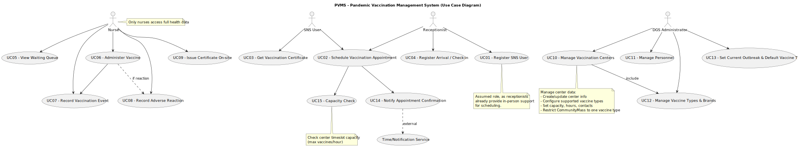

# Use Case Diagram (UCD)

| UC/US  | Description                                          |                   
|:-------|:-----------------------------------------------------|
| (UC01) | Register SNS User) as UC01                           |
| (UC02) | Schedule Vaccination Appointment) as UC02            |
| (UC03) | Get Vaccination Certificate) as UC03                 |
| (UC04) | Register Arrival / Check-in) as UC04                 |
| (UC05) | View Waiting Queue) as UC05                          |
| (UC06) | Administer Vaccine) as UC06                          |
| (UC07) | Record Vaccination Event) as UC07                    |
| (UC08) | Record Adverse Reaction) as UC08                     |
| (UC09) | Issue Certificate On-site) as UC09                   |
| (UC10) | Manage Vaccination Centers) as UC10                  |
| (UC11) | Manage Personnel) as UC11                            |
| (UC12) | Manage Vaccine Types & Brands) as UC12               |
| (UC13) | Set Current Outbreak & Default Vaccine Type) as UC13 |
| (UC14) | Notify Appointment Confirmation) as UC14             |
| (UC15) |  Capacity Check) as UC15                             |