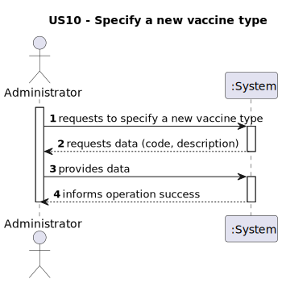
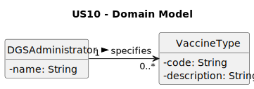
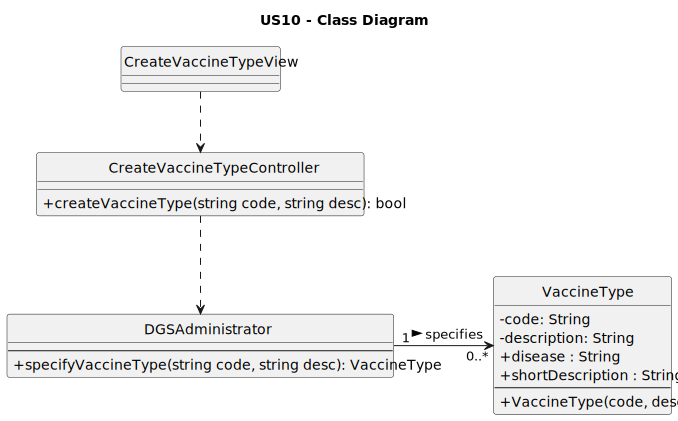

# US10 - As Administrator, I want to specify a new vaccine type.

## 1. Requirements Engineering

### 1.1. User Story Description

As an Administrator, I want to specify a new vaccine type.

### 1.2. Customer Specifications and Clarifications

**From the specifications document:**

> By simplicity, a vaccine type just comprehends a unique alphanumeric code and a brief description.

**From the client clarifications:**

> **Question:** A US10 pede para especificar um novo tipo de vacina, por acaso o código que é criado para o tipo de vacina é gerado automaticamente pelo sistema ou é o próprio administrador a selecionar o código do tipo de vacina?
> O código do tipo de vacina pode ser considerado o ID?
>
> **Answer:** O código do tipo de vacina é definido manually pelo administrador. Este código deve ser único e composto por exatamente 5 caracteres.
> Sim, pode ser considerado o identificador (ID) do tipo de vacina.

> **Question:** Para cada vacina existe uma marca que a identifica associadas a um lote, respetivamente. Devíamos considerar a opção de um determinado lote ter um problema? Além disso, como cada lote está associado a uma marcação (manhã ou tarde), se considerarmos a questão a cima, como deveria de ser resolvido? Pedimos ao utilizador para remarcar, remarca alguém do sistema (enfermeiro ou rececionista), ou apenas cancela a marcação?
>
> **Answer:** Nesta versão do sistema, não está prevista a gestão de problemas associados a lotes específicos de vacinas.
O agendamento da vacinação regista apenas o tipo de vacina, não sendo associada diretamente a um lote ou marca específica no momento da marcação.

> **Question:** No contexto do problema, cada vacina, além de outros aspetos deve conter a doença que trata.
Esta vacina, especificamente, vai ser o utilizador que vai escolher, ou já vai existir tipos predefinidos de vacina indicados pela DGS, ou apenas devem ser exibidos ao utilizador as vacinas às quais está elegível?
>
> **Answer:** No processo de agendamento da vacinação, o SNS user escolhe o tipo de vacina, entre as opções disponíveis. A gestão das vacinas e dos tipos de vacina é da responsabilidade do administrador do sistema.

### 1.3. Acceptance Criteria

- AC10-1: The vaccine type code cannot be empty or have less than five characters.
- AC10-2: The vaccine type description cannot be empty.
- AC10-3: The vaccine type code must be unique (not already exist in the system).

### 1.4. Found out Dependencies

- No dependencies were found.
### 1.5 Input and Output Data

**Input Data:**

- Typed data:
    - a code
    - a description

- Selected data:
    - n/a

**Output Data:**

- (In)success of the operation

### 1.6. System Sequence Diagram (SSD)

### 1.7 Other Relevant Remarks

The created vaccine type is ready to be used in vaccination center configurations or vaccine scheduling.

## 2. Analysis

### 2.1. Relevant Domain Model Excerpt

### 2.2. Other Remarks

- The Domain Model suggests the Administrator has the responsibility to manage (create) VaccineType objects.

- This responsibility is delegated to a VaccineTypeContainer (or Repository) to promote High Cohesion and Low Coupling.

## 3. Design - User Story Realization

### 3.1. Rationale

**The rationale grounds on the SSD interactions and the identified input/output data.**

The rationale grounds on the SSD interactions and the identified input/output data.

| Interaction ID | Question: Which class is responsible for...                               | Answer                       | Justification (with patterns)                                                                                                                                                 |
|:---------------|:---------------------------------------------------------------------------|:-----------------------------|:-----------------------------------------------------------------------------------------------------------------------------------------------------------------------------|
| Step 1         | ... interacting with the actor?                                           | CreateVaccineTypeView        | Pure Fabrication (PF): There is no reason to assign this responsibility to a Domain class; this class is created only to handle user interaction.                            |
|        | ... coordinating the US?                                                  | CreateVaccineTypeController  | Controller: Manages the US flow by receiving requests from the view and delegating work to other objects.                                                                    |
| Step 2         | ... requesting data (code, description)?                                  | CreateVaccineTypeView        | Information Expert (IE): This class is responsible for user interactions and asking the actor for the required data.                                                         |
| Step 3         | ... saving the inputted data (temporarily)?                               | CreateVaccineTypeView        | IE: It is responsible for keeping the data entered by the user until it is confirmed and sent to the controller/service.                                                    |
|       | ... instantiating a new vaccine type?                                     | VaccineTypeContainer         | Creator (Rule 1): In the DM, VaccineTypeContainer manages/owns the VaccineType collection, so it should create new VaccineType instances.                                   |
|        | ... initiating and delegating the creation of vaccine types?              | Administrator                | High Cohesion (HC) + Low Coupling (LC): The Administrator specifies the new vaccine type but delegates the responsibility of creation and storage to VaccineTypeContainer.  |
|         | ... validating all data (local validation)?                               | VaccineType                  | IE: The class knows its own data (validates code format, non-empty description, etc.).                                                                                       |
|        | ... validating all data (global validation)?                              | VaccineTypeContainer         | IE: It knows all vaccine types (validates code uniqueness – AC10-3).                                                                                                         |
|        | ... saving the created vaccine type?                                      | VaccineTypeContainer         | IE: It is the “owner” of the vaccine types collection and is responsible for persisting them.                                                                               |
| Step 4         | ... informing operation success?                                          | CreateVaccineTypeView        | IE: This class is responsible for user interactions and feedback to the Administrator.                                                                                       |

### Systematization ##

According to the taken rationale, the conceptual classes promoted to software classes are:

- Administrator

- VaccineType

Other software classes (i.e. Pure Fabrication) identified:

- CreateVaccineTypeView

- CreateVaccineTypeController

- VaccineTypeContainer

### 3.2. Sequence Diagram (SD)

### 3.3. Class Diagram (CD)

## 4. Tests
n/a

## 5. Construction (Implementation)

n/a 

## 6. Integration and Demo

n/a

## 7. Observations
n/a