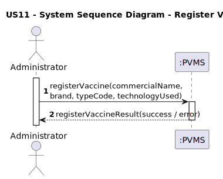
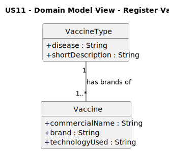
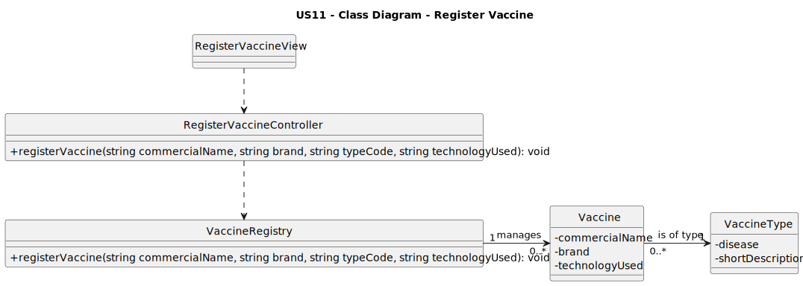

# US11 - register a vaccine

## 1. Requirements Engineering

### 1.1. User Story Description

As an Administrator, I want to register a new vaccine.

### 1.2. Customer Specifications and Clarifications

**From the specifications document:**

A vaccine must contain a commercial name, a brand, a technology used, and must be associated with an existing vaccine type already registered in the system.

**From the client clarifications:**

>**Question:** Can the technology used by a vaccine be any text provided by the administrator?  
>**Answer:** No. The technology must be selected from a predefined list of vaccine technologies. (cf. AC11-1)

### 1.3. Acceptance Criteria

- **AC11-1:** The vaccine technology must be selected from a predefined list of valid vaccine technologies.
- AC11-2: All mandatory fields (commercial name, brand, vaccine type, technology) must be provided.
- AC11-3: It must not be possible to register a vaccine with the same commercial name and brand as an existing one.
- AC11-4: The selected vaccine type must correspond to an existing registered VaccineType.

### 1.4. Found Out Dependencies

- The list of VaccineTypes must already exist in the system.
- The predefined list of valid vaccine technologies must be available.
- Administrator authentication/authorization.

### 1.5 Input and Output Data

**Input Data:**

- **Typed data:**
    - commercialName
    - brand

- **Selected data:**
    - typeCode (from existing VaccineType entries)
    - technologyUsed (from predefined list of vaccine technologies)

**Output Data:**

- (In)success of the operation (confirmation or error message)

### 1.6. System Sequence Diagram (SSD)

### 1.7 Other Relevant Remarks

- Once registered, the vaccine becomes available for use in the subsequent vaccination processes.

## 2. Analysis

### 2.1. Relevant Domain Model Excerpt

The following excerpt of the Domain Model represents the concepts required to support the registration of a vaccine:

**Explanation:**

- **VaccineType**  
  Represents a specific disease-targeted category (e.g., COVID-19, Influenza).  
  It contains the attributes `disease` and `shortDescription`.

- **Vaccine**  
  Represents a concrete vaccine product that can be administered in the system.  
  It contains the attributes `commercialName`, `brand`, and `technologyUsed`.

- **Association VaccineType–Vaccine**  
  A `VaccineType` may have several associated `Vaccine` instances, but each `Vaccine` belongs to exactly one `VaccineType`.

This excerpt is sufficient to represent the domain concepts required to fulfill US11.

---

### 2.2. Other Remarks

- Although `technologyUsed` is modelled as a simple attribute in the Domain Model, Acceptance Criterion AC11-1 requires that it be selected from a predefined list of allowed vaccine technologies.
- The uniqueness of the pair `(commercialName, brand)` is a **business rule** and is **not explicitly represented** in the Domain Model. This rule will be enforced during the design/implementation phase.
- No additional analysis artifacts (e.g., activity or state diagrams) were considered necessary for this User Story.

## 3.1. Rationale

**The rationale grounds on the SSD interactions and the identified input/output data.**

| Interaction ID | Question: Which class is responsible for...                                        | Answer                   | Justification (with patterns)                                                                                              |
|:--------------:|:------------------------------------------------------------------------------------|:-------------------------|:---------------------------------------------------------------------------------------------------------------------------|
| Step 1         | interacting with the actor (Administrator)?                                        | RegisterVaccineView      | **Pure Fabrication** and **Information Expert** for user interaction.                                                     |
|                | receiving the system operation `registerVaccine(...)`?                              | RegisterVaccineController| **GRASP Controller**: coordinates the use case.                                                                            |
|                | coordinating the execution of the US?                                               | RegisterVaccineController| **Controller pattern**: centralizes the workflow.                                                                          |
|                | performing business rules & execution of `registerVaccine(...)`?                    | VaccineRegistry          | **Information Expert** and **Pure Fabrication** for vaccine management.                                                   |
|                | creating a new Vaccine instance?                                                    | VaccineRegistry          | **Creator**: receives all initial data required to build a Vaccine.                                                        |
|                | obtaining the corresponding `VaccineType` from `typeCode`?                         | VaccineRegistry          | **Information Expert**: knows/queries stored VaccineTypes.                                                                 |
|                | validating local data (fields of the Vaccine)?                                      | Vaccine                  | **Information Expert**: object validates its own state.                                                                    |
|                | validating global constraints (duplicate vaccines)?                                 | VaccineRegistry          | **Information Expert**: manages all Vaccine instances.                                                                     |
|                | checking if `technologyUsed` belongs to allowed list (AC11-1)?                      | VaccineRegistry          | **Information Expert** for configuration rules.                                                                            |
| Step 2         | informing the (in)success of the operation to the actor?                           | RegisterVaccineView      | **Information Expert** for user feedback.                                                                                  |

### Systematization

According to the taken rationale, the conceptual classes promoted to software classes are:

- Vaccine
- VaccineType

Other software classes (i.e. Pure Fabrication) identified:

- RegisterVaccineView
- RegisterVaccineController
- VaccineRegistry

### 3.2. Sequence Diagram (SD)

The following sequence diagram represents the dynamic view of the main software objects involved in the realization of this User Story.

### 3.3. Class Diagram (CD)

The following class diagram represents the main software classes involved in the realization of this User Story, as well as their relations, attributes and main methods.

## 4. Tests
n/a

## 5. Construction (Implementation)
n/a

## 6. Integration and Demo
n/a

## 7. Observations
n/a