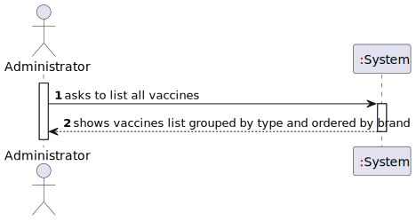
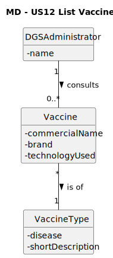
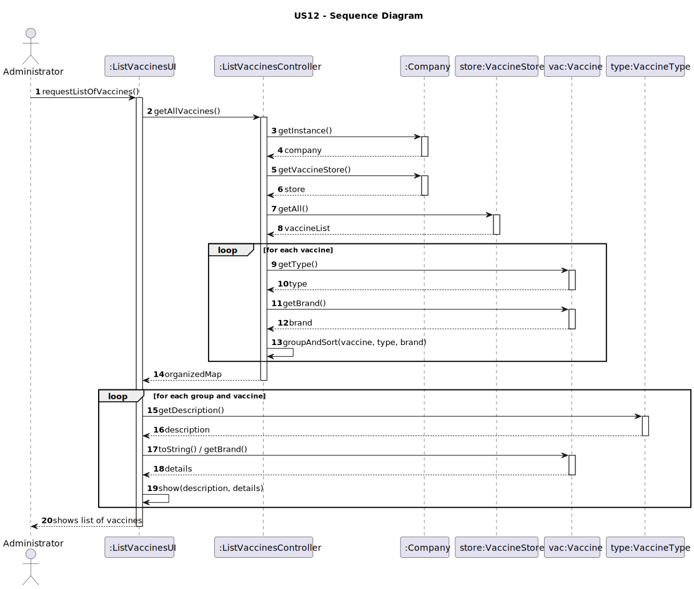
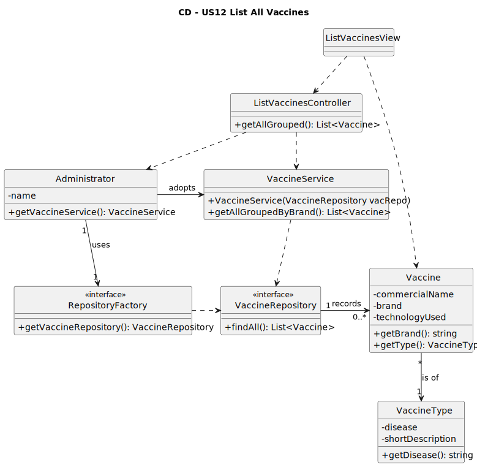

# US12 - list all vaccines

## 1. Requirements Engineering

### 1.1. User Story Description

As an Administrator, I want to get a list of all vaccines.

### 1.2. Customer Specifications and Clarifications

**From the specifications document:**

The Administrator must be able to consult every registered vaccine to support decision making and data verification.

**From the client clarifications:**

> **Question:** 
> **Answer:** 

### 1.3. Acceptance Criteria

- **AC12-1:** The vaccines should be grouped by vaccine type and then listed alphabetically by brand within each group.

### 1.4. Found Out Dependencies

- Vaccine types and vaccines must already be registered in the system (output of US11 and previous work).
- Administrator authentication/authorization must be in place.
- Access to the vaccine repository (Company → VaccineStore) is required to fetch the data set.

### 1.5. Input and Output Data

**Input Data:**

- *(none)* – the operation displays every vaccine without filters.

**Output Data:**

- Structured list of vaccines:
  - Group identifier (vaccine type description/disease).
  - For each vaccine in the group: commercial name, brand, technology used.
  - Ordering: alphabetical by brand inside each group.

### 1.6. System Sequence Diagram (SSD)

### 1.7. Other Relevant Remarks

- The operation is read-only and does not change domain state.
- The presentation layer is responsible for formatting the grouped result for the Administrator.

## 2. Analysis

### 2.1. Relevant Domain Model Excerpt

**Explanation:**

- **VaccineType** – represents the category of vaccines targeting the same disease (attributes `disease`, `shortDescription`).
- **Vaccine** – represents a concrete vaccine product that can be administered (`commercialName`, `brand`, `technologyUsed`).
- **Association VaccineType–Vaccine** – one `VaccineType` has one or more `Vaccine` instances; each `Vaccine` belongs to exactly one `VaccineType`. This supports grouping vaccines by their type.

This excerpt contains all concepts required to fulfill US12.

### 2.2. Other Remarks

- Sorting by brand is a presentation/business rule derived from AC12-1 and is not explicitly represented in the Domain Model.
- No additional analysis artifacts were deemed necessary for this read-only user story.

## 3.1. Rationale

**The rationale grounds on the SSD interactions and on the identified input/output data.**

| Interaction ID | Question: Which class is responsible for...                               | Answer                     | Justification (with patterns)                                                                 |
|:--------------:|:---------------------------------------------------------------------------|:---------------------------|:----------------------------------------------------------------------------------------------|
| Step 1         | interacting with the actor (Administrator)?                                | ListVaccinesUI             | **Pure Fabrication / Information Expert** for user interaction.                               |
|                | receiving the system operation `getAllVaccines()`?                         | ListVaccinesController     | **GRASP Controller** coordinating the use case.                                               |
|                | coordinating the execution of the US?                                      | ListVaccinesController     | **Controller** centralizes the workflow.                                                      |
|                | obtaining the collection of vaccines?                                      | VaccineStore (via Company) | **Information Expert / Pure Fabrication** that manages stored vaccines.                       |
|                | grouping vaccines by type and sorting by brand (AC12-1)?                   | ListVaccinesController     | **Information Expert** for the specific use-case rule (no state mutation needed).             |
| Step 2         | providing the vaccine type description for display?                        | VaccineType                | **Information Expert** about its own descriptive data.                                        |
|                | providing vaccine brand/commercial details for display?                    | Vaccine                    | **Information Expert** about its own attributes.                                              |
|                | informing the (in)success of the listing to the actor?                     | ListVaccinesUI             | **Information Expert** for user feedback/presentation.                                        |

### Systematization

According to the rationale, the following conceptual classes are promoted to software classes:

- Vaccine
- VaccineType

Other software classes (Pure Fabrication) identified:

- ListVaccinesUI
- ListVaccinesController
- VaccineStore (accessed via Company singleton)

### 3.2. Sequence Diagram (SD)

### 3.3. Class Diagram (CD)

## 4. Tests

n/a

## 5. Construction (Implementation)

n/a

## 6. Integration and Demo

n/a

## 7. Observations

n/a

