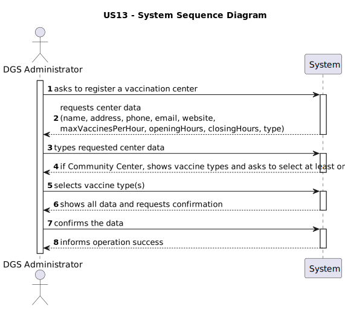
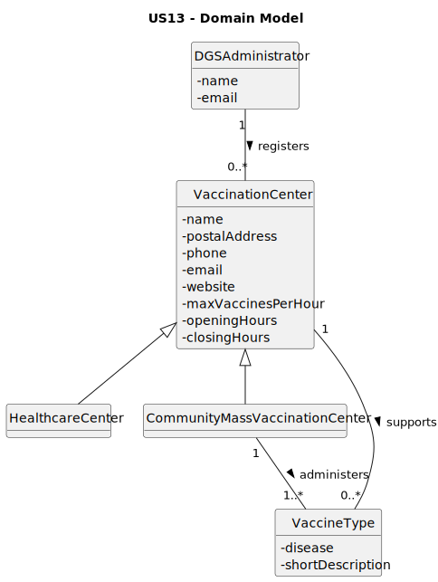
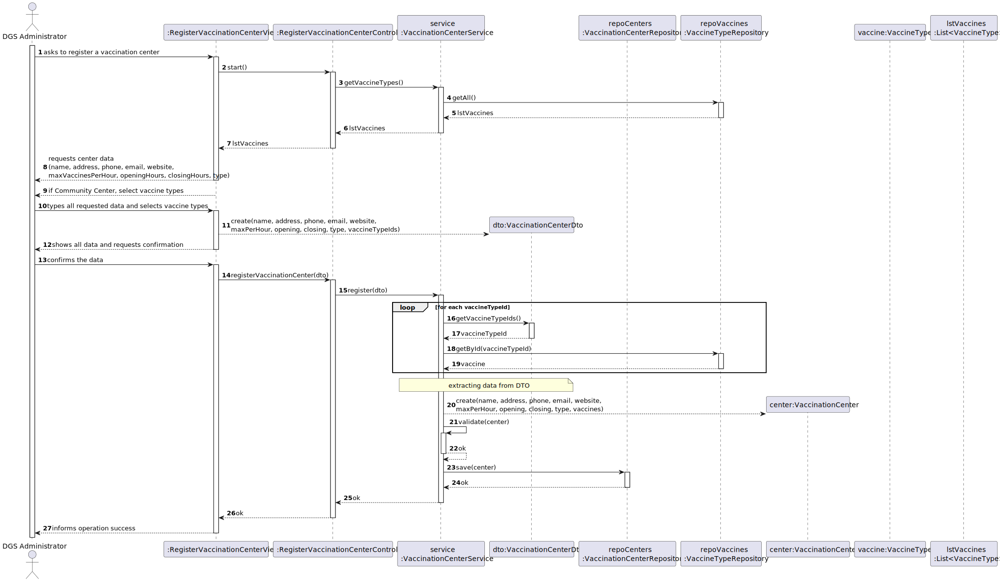
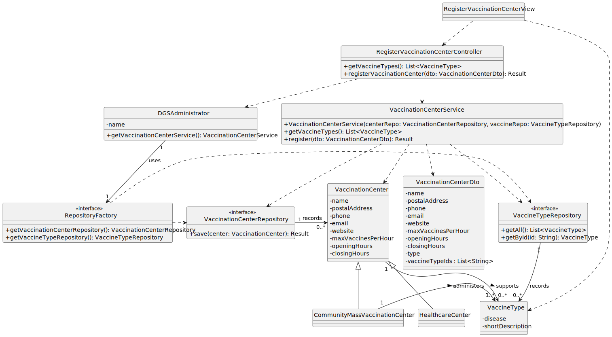

# US13 - As Administrator, I want to register a vaccination center

[Priority: High]

---

## 1. Requirements Engineering

### 1.1. User Story Description

**US13** – As an *Administrator*, I want to register a vaccination center.

---

### 1.2. Customer Specifications and Clarifications

**Q1** Nesta US é pedido para registar um centro de vacinação, para cada centro de vacinação criado, seja um centro de saúde, seja um centro comunitário de vacinação em massa, é necessário a criação de um ID ou código único no seu registo? Caso sim, este código deve ser gerado automaticamente ou registado pelo administrador?
Sobre o horário de abertura e o de encerramento, existe algum horário fixo ou depende do centro de vacinação registado?

**A1** Os centros de vacinação não possuem um identificador (ID). Durante o processo de criação do centro, é obrigatória a introdução de um nome, o qual deve ser único relativamente a todos os centros registados.
Cada centro estabelece autonomamente o seu horário de abertura e de encerramento. Informação adicional pode ser consultada no tópico Horários de Funcionamento deste Fórum.

---

### 1.3. Acceptance Criteria

* **AC13-1:** Community Mass Vaccination Centers must include the vaccine type administered.

---

### 1.4. Found Out Dependencies

* This US depends on the existence of an authenticated **DGSAdministrator** actor.
* This US depends on the prior existence of **Vaccine Types** registered in the system.
---

### 1.5 Input and Output Data

**Input Data (from Administrator to System)**

| Data                    | Input Mode            |
| ----------------------- |-----------------------|
| Name                    | Typed                 |
| Postal Address          | Typed                 |
| Phone                   | Typed                 |
| E-mail                  | Typed                 |
| Website                 | Typed                 |
| Max Vaccines Per Hour   | Typed                 |
| Opening Hours           | Typed                 |
| Closing Hours           | Typed                 |
| Vaccination Center Type | Selected from list    |
| Vaccine Type(s)         | Selected from list    |

---

**Output Data (from System to Administrator)**

| Data                                   | Description                                                            |
| -------------------------------------- | ---------------------------------------------------------------------- |
| Confirmation message                   | Informs that the center was successfully registered.                   |
| Error message – missing mandatory data | Indicates which mandatory fields are missing.                          |
| Error message – missing vaccine types  | Indicates that a Community Center must have at least one vaccine type. |
| List of available vaccine types        | List of available vaccine types for selection.                         |

---

### 1.6. System Sequence Diagram (SSD)

*The SSD represents the interactions between the Administrator and the System for registering a vaccination center.*

---

### 1.7 Other Relevant Remarks

* Only a **DGS Administrator** is allowed to register vaccination centers.
* The selection of **vaccine types is mandatory only for Community Mass Vaccination Centers**.

---

## 2. Analysis

### 2.1. Relevant Domain Model Excerpt

*This excerpt represents the domain concepts required to support the registration of a vaccination center.*

Main domain concepts (as reflected in the DM for this US):

* **Administrator (DGSAdministrator)**

    * Represents the user with permission to register vaccination centers.

* **VaccinationCenter**

    * Base entity for vaccination centers.
    * Main attributes:

        * Name
        * Postal Address
        * Phone
        * E-mail
        * Website
        * Max Vaccines Per Hour
        * Opening Hours
        * Closing Hours

* **CommunityMassVaccinationCenter**

    * Specialization of `VaccinationCenter`.
    * Must be associated with **one or more Vaccine Types**.

* **HealthcareCenter**

    * Specialization of `VaccinationCenter`.
    * Association with Vaccine Types is not mandatory.

* **VaccineType**

    * Represents the type of vaccine administered.

* **VaccinationCenterRepository**

    * Responsible for persisting vaccination centers.
    * Provides operations to save centers.

---

### 2.2. Other Remarks

* **Domain Invariants:**

    * A `VaccinationCenter` must always have:

        * Name, address, phone, e-mail, maximum capacity, opening and closing hours.
    * A `CommunityMassVaccinationCenter` must always be associated with:

        * At least one `VaccineType`.

* Validation of center types must be enforced at the **Service** level.

---

## 3. Design – User Story Realization

### 3.1. Rationale

**The rationale is based on the interactions identified in the SSD and the defined input/output data.**

| Interaction ID | Question: Which class is responsible for... | Answer | Justification                                                       |
| :--- | :--- | :--- |:--------------------------------------------------------------------|
| 1 | ...starting the registration process? | `RegisterVaccinationCenterView` | **Pure Fabrication**: Handles user interaction.                     |
| 2 | ...displaying form fields? | `RegisterVaccinationCenterView` | **High Cohesion**: Presentation belongs to UI.                      |
| 3 | ...showing vaccine types? | `RegisterVaccinationCenterView` | **High Cohesion**: UI handles selection lists.                      |
| 4 | ...coordinating the creation? | `RegisterVaccinationCenterController` | **Controller**: Coordinates the system operation.                   |
| 5 | ...validating business rules (AC13-1)? | `VaccinationCenterService` | **Information Expert**: Business rules belong to the service layer. |
| 6 | ...persisting the center? | `VaccinationCenterRepository` | **Pure Fabrication**: Responsible for persistence.                  |

---

#### Systematization

Conceptual classes promoted to software classes:
* `VaccinationCenter`, `CommunityMassVaccinationCenter`, `HealthcareCenter`, `VaccineType`, `DGSAdministrator`.

Pure Fabrication classes:
* `RegisterVaccinationCenterView`, `RegisterVaccinationCenterController`, `VaccinationCenterService`, `VaccinationCenterRepository`, `VaccineTypeRepository`, `RepositoryFactory`, `VaccinationCenterDto`.

### 3.2. Sequence Diagram (SD)

*The SD represents the detailed interactions between UI, Controller, Service, Repositories, and Domain Objects.*

---

### 3.3. Class Diagram (CD)

*The CD represents the main software classes involved, their relations, attributes, and relevant methods.*

---

## 4. Tests

n/a

---

## 5. Construction (Implementation)

n/a

---

## 6. Integration and Demo

n/a

---

## 7. Observations

n/a

---
