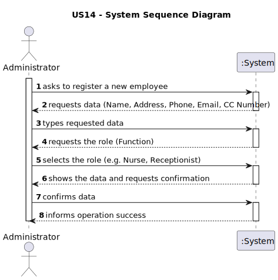
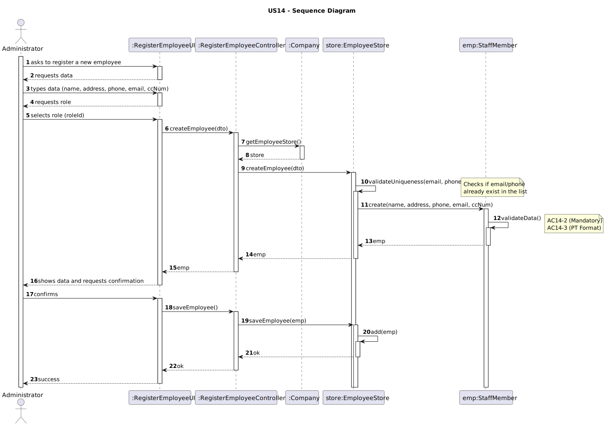
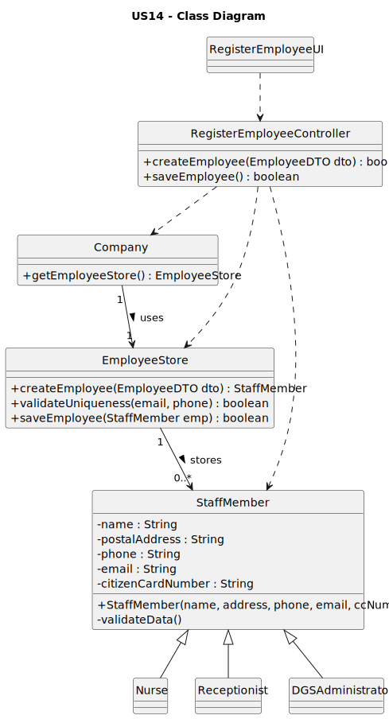

# US14 - As Administrator, I want to register an employee

[Priority: High]

---

## 1. Requirements Engineering

### 1.1. User Story Description

**US14** – As *Administrator*, I want to register an employee.

### 1.2. Customer Specifications and Clarifications

**Q1** Pode confirmar quais os campos que devem compor o parâmetro “Postal Address” dos colaboradores e quais são obrigatórios?

**A1** Relativamente ao postal address, o cliente não pretende definir requisitos específicos quanto à sua composição ou formato. Ainda assim, recomenda-se a adoção de um formato que inclua os elementos essenciais: rua, número, código postal e localidade.

### 1.3. Acceptance Criteria

* **AC14-1:** Each employee must be assigned a single function/role within the system.
* **AC14-2:** The attributes Name, Phone Number, and E-mail Address are mandatory.
* **AC14-3:** The Phone Number and Citizen Card Number must comply with the Portuguese format.
* **AC14-4:** The Phone Number and E-mail Address must be unique across all registered employees.

### 1.4. Found out Dependencies

* This US depends on the existence of an authenticated DGSAdministrator actor.
* The domain classes StaffMember, Nurse, Receptionist, and DGSAdministrator must be defined in the Domain Model.

### 1.5 Input and Output Data

**Input Data (from Administrator to System)**

| Data                        | Type          | Description                                               | Input Mode         |
|-----------------------------|---------------|-----------------------------------------------------------|--------------------|
| Name                        | Text          | Full name of the employee                                | Typed              |
| Phone Number                | Text          | Portuguese phone number                                  | Typed              |
| E-mail Address              | Text          | Employee’s e-mail address                                | Typed              |
| Citizen Card Number         | Text          | Portuguese Citizen Card number                           | Typed              |
| Function/Role               | Selection     | Single role/function assigned to the employee            | Selected from list |

**Output Data (from System to Administrator)**

| Data                                | Description                                                               |
|-------------------------------------|---------------------------------------------------------------------------|
| Confirmation message                | Informs that the employee was successfully registered.                    |
| Error message – missing mandatory   | Indicates which mandatory field(s) are missing or invalid.               |
| Error message – invalid formats     | Indicates invalid phone or citizen card format.                           |
| Error message – uniqueness conflict | Indicates existing employee with same e-mail and/or phone number.         |
| List of available roles             | The system shows the available roles for the Administrator to choose.     |

### 1.6. System Sequence Diagram (SSD)

_The SSD depicts the Actor–System interactions required to register an employee, including data input and validation feedback._

### 1.7 Other Relevant Remarks

- The system should provide **clear validation messages** to guide the Administrator in correcting invalid inputs.
- This US is expected to be executed **infrequently but regularly**, whenever new employees join the organization.

---

## 2. Analysis

### 2.1. Relevant Domain Model Excerpt

_This excerpt represents the domain concepts required to support the registration of an employee._

Main domain concepts (as reflected in the DM for this US):

- **Administrator**
    - Represents a system user with permission to manage employees.
- **Employee**
    - Aggregate root holding the main employee information:
        - Name
        - Phone Number
        - E-mail Address
        - Citizen Card Number
        - Function/Role
- **Role / Function**
    - Represents the function/role that can be assigned to exactly one employee at registration time.
- **Employee Repository**
    - Responsible for storing and retrieving employees from the persistence layer.
    - Provides operations to:
        - Save a new employee
        - Check uniqueness (by phone, e-mail, citizen card, etc.)

### 2.2. Other Remarks

- **Invariants** in the domain model:
    - An `Employee` instance must always have:
        - Non-empty Name, Phone, and E-mail.
        - A valid Portuguese phone number.
        - A valid Citizen Card Number.
        - Exactly one Role assigned.
    - Phone and e-mail are globally unique per `Employee` aggregate.
- Validation logic can be implemented as:
    - Value Objects (`PhoneNumber`, `Email`, `CitizenCardNumber`) encapsulating format rules.
    - Aggregate-level rules checking uniqueness via repository before creation.

---

## 3. Design – User Story Realization

### 3.1. Rationale

**The rationale is grounded on the SSD interactions and the identified input/output data.**

| Interaction ID | Question: Which class is responsible for... | Answer | Justification (with patterns) |
|:--- |:--- |:--- |:--- |
| 1 | ...handling the user's action to start registration? | `RegisterEmployeeUI` | **Low Coupling & High Cohesion** – UI handles user actions in the presentation layer only. |
| 2 | ...displaying the form fields to be filled? | `RegisterEmployeeUI` | **High Cohesion** – UI is responsible for rendering all input fields. |
| 3 | ...capturing the data typed by the user (name, address, etc.)? | `RegisterEmployeeUI` | **Information Expert** – UI has direct access to the values entered in the form. |
| 4 | ...displaying the list of available roles for selection? | `RegisterEmployeeUI` | **High Cohesion** – showing selectable options is a pure UI concern. |
| 5 | ...capturing the selected role and delegating the creation request? | `RegisterEmployeeUI` | **Indirection & Low Coupling** – UI gathers input and forwards a system operation to the Controller. |
| 6 | ...coordinating the *creation* (in memory) of the object for confirmation? | `RegisterEmployeeController` | **Controller** – handles the “create employee” system operation and coordinates domain objects. |
| 7 | ...coordinating the *persistence* (saving) of the object upon confirmation? | `RegisterEmployeeController` | **Controller & Low Coupling** – handles “save employee” and delegates persistence to the Store. |
| 8 | ...displaying the final success message to the user? | `RegisterEmployeeUI` | **High Cohesion** – UI is responsible for user feedback messages. |

#### Systematization

According to the rationale above, the conceptual classes promoted to software classes are:

- `Employee`
- `Role` / `Function`
- `Administrator`
- `EmployeeRepository`
- `PhoneNumber` (Value Object)
- `Email` (Value Object)
- `CitizenCardNumber` (Value Object)

Other software classes (i.e. Pure Fabrication) identified:

- `RegisterEmployeeUI`
- `RegisterEmployeeController`

### 3.2. Sequence Diagram (SD)

_The SD represents the detailed software interactions (UI, controller, domain objects, repositories) required to fulfill the US._

### 3.3. Class Diagram (CD)

_The CD represents the main software classes involved, their relations, attributes and relevant methods._

---

## 4. Tests

n/a

---

## 5. Construction (Implementation)

n/a

---

## 6. Integration and Demo

n/a

---

## 7. Observations

n/a

---
