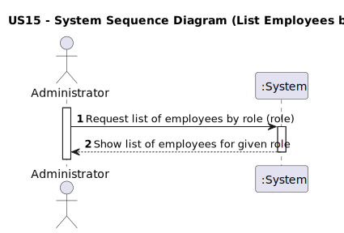
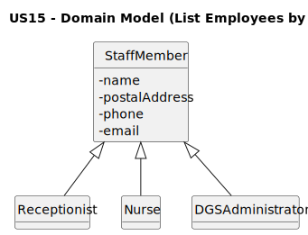
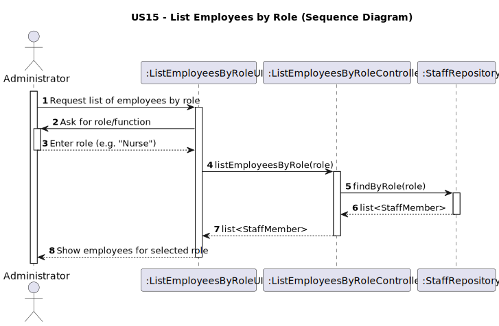
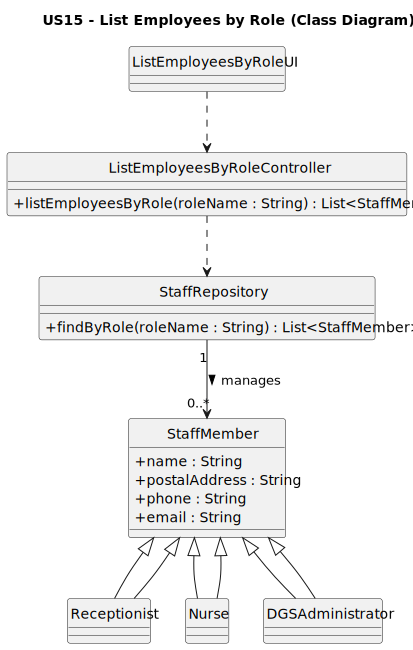

# US15 - list employees by role

## 1. Requirements Engineering

### 1.1. User Story Description

As an Administrator, I want to get a list of employees assigned to a specific function/role.

### 1.2. Customer Specifications and Clarifications

**From the specifications document:**

The system must allow an Administrator to obtain a list of employees that are currently assigned to a given function/role (e.g. Receptionist, Nurse, DGS Administrator).

**From the client clarifications:**

> **Question:**

> **Answer:** 

### 1.3. Acceptance Criteria

- **AC15-1:** The role must be selected from a predefined list of valid staff roles.
- **AC15-2:** The system must display all employees assigned to the selected role.
- **AC15-3:** If no employees are assigned to the selected role, the system must present an appropriate “no employees found” message.
- **AC15-4:** Only authenticated and authorized Administrators can access this functionality.

### 1.4. Found Out Dependencies

- The list of valid staff roles (e.g. Nurse, Receptionist, DGSAdministrator) must already exist in the system.
- Employees (instances of StaffMember and its specializations) must already be registered and associated with roles.
- Administrator authentication/authorization must be in place.

### 1.5. Input and Output Data

**Input Data:**

- **Selected data:**
    - `role` (from a predefined list of valid staff roles)

**Output Data:**

- List of employees (basic information such as name, email, phone, role) assigned to the selected role.
- (In)success of the operation (confirmation or error message, including the case “no employees found”).

### 1.6. System Sequence Diagram (SSD)

The following SSD represents the interaction between the Administrator and the System for this user story:

### 1.7. Other Relevant Remarks

- The retrieved list of employees is read-only in the context of this user story; US15 does not cover editing or removing employees.
- The list may be further filtered or sorted (e.g. by name) at UI level, but such functionality is outside the core scope of US15.

---

## 2. Analysis

### 2.1. Relevant Domain Model Excerpt

The following excerpt of the Domain Model represents the concepts required to support listing employees by role:

**Explanation:**

- **StaffMember**  
  Represents a generic employee of the system.  
  It contains attributes such as `name`, `postalAddress`, `phone`, and `email`.

- **Receptionist**, **Nurse**, **DGSAdministrator**  
  These are specializations of `StaffMember` that represent concrete staff roles in the system.

- **Specialization relationship**  
  Each `StaffMember` instance has exactly one concrete role (e.g. a staff member is either a `Receptionist`, a `Nurse`, or a `DGSAdministrator`).  
  Listing employees by role corresponds to retrieving all `StaffMember` instances of a given specialization/role.

This excerpt is sufficient to represent the domain concepts required to fulfil US15.

---

### 2.2. Other Remarks

- The set of valid roles is modelled via subtypes of `StaffMember` in the Domain Model. At implementation level, this may correspond to specific classes, an enumeration, or a configuration table, as long as the predefined set of roles is respected.
- No additional analysis artifacts (e.g., activity or state diagrams) were considered necessary for this User Story.

---

## 3. Design

### 3.1. Rationale

**The rationale grounds on the SSD interactions and the identified input/output data.**

| Interaction ID | Question: Which class is responsible for…                                             | Answer                         | Justification (with patterns)                                                                 |
|:--------------:|:--------------------------------------------------------------------------------------|:-------------------------------|:----------------------------------------------------------------------------------------------|
| Step 1         | interacting with the actor (Administrator)?                                           | ListEmployeesByRoleView        | **Pure Fabrication** and **Information Expert** for user interaction.                        |
|                | receiving the system operation `listEmployeesByRole(role)`?                           | ListEmployeesByRoleController  | **GRASP Controller**: coordinates the use case.                                              |
|                | coordinating the execution of the US?                                                 | ListEmployeesByRoleController  | **Controller pattern**: centralizes the workflow.                                            |
|                | performing business rules related to retrieving employees by role?                    | StaffRepository                | **Information Expert** on stored staff members and roles.                                    |
|                | obtaining all `StaffMember` instances assigned to the given role?                     | StaffRepository                | **Information Expert**: knows/query staff data.                                              |
|                | checking if the selected role is valid (belongs to the predefined list of roles)?     | ListEmployeesByRoleController / StaffRepository | **Information Expert** on configuration/roles; **Low Coupling** and **High Cohesion**.      |
|                | handling the case where no employees exist for the selected role?                     | ListEmployeesByRoleController  | Orchestrates responses and decides whether to return an empty list or an error/notice.       |
|                | formatting the result to be presented to the actor?                                   | ListEmployeesByRoleView        | **Information Expert** for user feedback (presentation concerns).                            |
| Step 2         | informing the (in)success of the operation to the actor?                              | ListEmployeesByRoleView        | **Information Expert** for user feedback.                                                    |

### Systematization

According to the taken rationale, the **conceptual classes** promoted to software classes are:

- `StaffMember`
- `Receptionist`
- `Nurse`
- `DGSAdministrator`

Other software classes (i.e. **Pure Fabrication**) identified:

- `ListEmployeesByRoleView`
- `ListEmployeesByRoleController`
- `StaffRepository`

### 3.2. Sequence Diagram (SD)

The following sequence diagram represents the dynamic view of the main software objects involved in the realization of this User Story.

### 3.3. Class Diagram (CD)

The following class diagram represents the main software classes involved in the realization of this User Story, as well as their relations, attributes and main methods.

---

## 4. Tests

n/a

---

## 5. Construction (Implementation)

n/a

---

## 6. Integration and Demo

n/a

---

## 7. Observations

n/a
