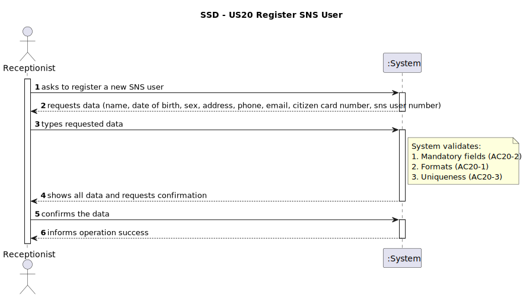
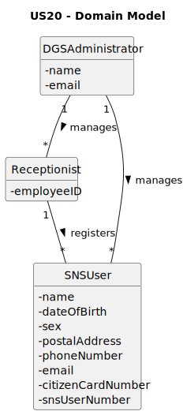
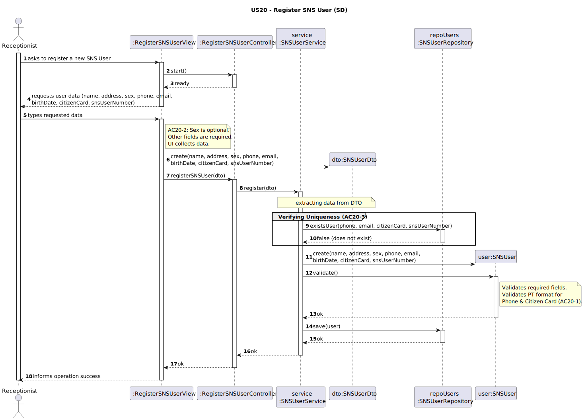
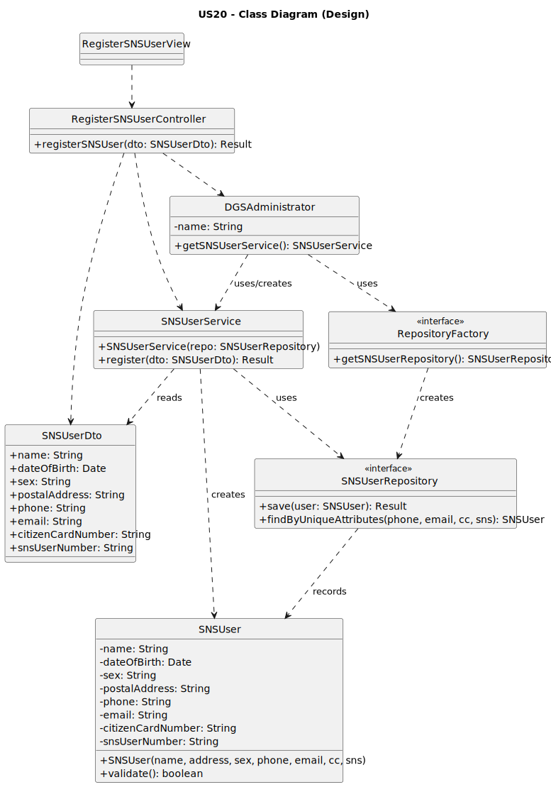

# US10 - As Administrator, I want to specify a new vaccine type.

## 1. Requirements Engineering

### 1.1. User Story Description

As Receptionist, I want to register an SNS user.

### 1.2. Customer Specifications and Clarifications

**From the specifications document:**

> SNS users must be registered in the system with the following data: name, date of birth, sex, postal address, phone number, email, citizen card number, and SNS user number.

**From the client clarifications:**

> **Question:** Nesta US é referido como um dos AC que o Nº telemóvel e Nº CC registado devem ser no formato Português.
No caso do Nº CC o utilizador deve introduzir o formato CC simples de 8 dígitos apenas "xxxxxxxx" ou o formato completo composto pelos 8 dígitos mais os 4 caracteres seguintes " n xyz"? E a sua verificação quanto ao ser um input legitimamente português deve ser feito apenas tendo em conta o nº de dígitos introduzidos?
Por outro lado sobre o Nº telemóvel, a sua verificação do formato português como deve ser realizada? O sistema deve introduzir automaticamente o código "+351" e apenas verificar se o valor introduzido tem 9 dígitos válidos?
>
> **Answer:** No caso do número do Cartão de Cidadão, deve ser introduzido apenas o formato simples de 8 dígitos.
Quanto ao número de telemóvel, pretende-se um número com 9 dígitos.

> **Question:** Nesta US um dos AC é referente à introdução do atributo "Sex", podemos considerar este atributo como um selected data? Onde são dadas ao utilizador uma lista pré-definida de opções da qual deve selecionar uma?
Para além disso, e caso possamos considerar tal situação, sendo que este atributo é opcional esta decisão pode estar incluída no leque de opções dadas ao utilizador? Por exemplo " 1 -  Male ; 2 -  Female ; 3 - Prefer not to say", onde a opção "Prefer not to say"  representaria a decisão de não introdução do atributo "Sex" por parte do utilizador.
Ou é necessário fazer primeiro a verificação se o utilizador pretende introduzir tal atributo e só depois dar as respetivas opções disponíveis?>
> 
> **Answer:** Ambas as alternativas podem ser consideradas válidas, sendo que a opção male / female / prefer not to say, se adequa particularmente bem.

> **Question:** For the user identification code within the system, do we consider the SNS user number as the unique identifier?
> 
> **Answer:** AC20-3 establishes that Phone Number, E-mail Address, Citizen Card Number and SNS User Number must be unique across all registered SNS users. Therefore, any of these can serve as a unique identifier for the SNS user.

> **Question:** Does each SNS user have an associated health history in the system? If so, which specific health-related data should be stored (e.g., allergies, chronic conditions, contraindications, past vaccinations, adverse reactions)?
> 
> **Answer:** No. The system does not store health history when an SNS user is registered.

### 1.3. Acceptance Criteria

- AC20-1: The Phone Number and Citizen Card Number must comply with the Portuguese format.
- AC20-2: The attribute Sex is optional. All other fields are required.
- AC20-3: The Phone Number, E-mail Address, Citizen Card Number and SNS User Number must be
unique across all registered SNS users

### 1.4. Found out Dependencies

**Authentication:** The Receptionist must be registered and authenticated in the system to access this functionality.

### 1.5 Input and Output Data

**Input Data:**

* **Typed data:**
    * Name
    * Date of Birth
    * Postal Address
    * Phone Number
    * E-mail Address
    * Citizen Card Number
    * SNS User Number

* **Selected data:**
    * Sex

**Output Data:**
* List of gathered data (for confirmation)
* (In)success of the operation

### 1.6. System Sequence Diagram (SSD)

### 1.7 Other Relevant Remarks

The registered SNS User is now available in the system to schedule vaccination appointments and request the issuance of vaccination certificates.
## 2. Analysis

### 2.1. Relevant Domain Model Excerpt

### 2.2. Other Remarks

- The DGSAdministrator acts as the root entity/facade in the design to provide access to services, although in the Domain Model, the relationship is conceptualized as the organization managing the users.

- The Receptionist interacts with the system to register the user.

- Data uniqueness must be enforced globally across the system persistence mechanism.
## 3. Design - User Story Realization

### 3.1. Rationale

**The rationale grounds on the SSD interactions and the identified input/output data.**

The rationale grounds on the SSD interactions and the identified input/output data.

| Interaction ID | Question: Which class is responsible for...  | Answer | Justification (with patterns)                                                                                                                |
|:---|:---------------------------------------------|:---|:---------------------------------------------------------------------------------------------------------------------------------------------|
| **Step 1** | ... interacting with the actor?              | `RegisterSNSUserView` | Pure Fabrication: There is no reason to assign this responsibility to a Domain class; this class is created only to handle user interaction. |
| | ...coordinating the US?                      | `RegisterSNSUserController` | Controller: Manages the US flow by receiving requests from the view and delegating work to the Service.                                      |
| **Step 2** | ... requesting data (name, address, etc.)?   | `RegisterSNSUserView` | Information Expert: This class is responsible for user interactions and asking the actor for the required data.                              |
| **Step 3** | ... transferring data (UI to Domain)?        | `SNSUserDto` | Data Transfer Object: Encapsulates the raw data entered by the user to transport it from the UI to the Domain layer.                         |
| | ... instantiating the new **SNS User**?      | `SNSUserService` | Creator: In this design, the Service orchestrates the transaction and explicitly creates the domain object (`Svc -> Dom**`).                 |
| **Step 4** | ... validating global rules (Uniqueness)?    | `SNSUserRepository` | Information Expert:** It accesses the persistent storage to check if the user already exists (AC20-3) via `existsUser`.                      |
| | ... validating local rules (Business Rules)? | `SNSUser` | Information Expert: The domain object knows its own constraints (AC20-1, AC20-2) and validates itself upon creation.                         |
| **Step 5** | ... saving the created SNS User?             | `SNSUserRepository` | Information Expert / Repository: It is the owner of the persistence mechanism and is responsible for saving the object.                      |
| **Step 6** | ... informing operation success?             | `RegisterSNSUserView` | Information Expert: This class is responsible for displaying the final feedback to the Receptionist.                                         |
### Systematization ##

According to the taken rationale, the conceptual classes promoted to software classes are:

- SNSUser
- DGSAdministrator (Representing the Organization/Root)

Other software classes (i.e. Pure Fabrication) identified:

- RegisterSNSUserUI (View)

- RegisterSNSUserController (Controller)

- SNSUserService (Service)

- SNSUserRepository (Repository)

- SNSUserDTO (DTO)

- RepositoryFactory (Factory)

### 3.2. Sequence Diagram (SD)

### 3.3. Class Diagram (CD)

## 4. Tests
n/a

## 5. Construction (Implementation)

n/a

## 6. Integration and Demo

n/a

## 7. Observations
n/a