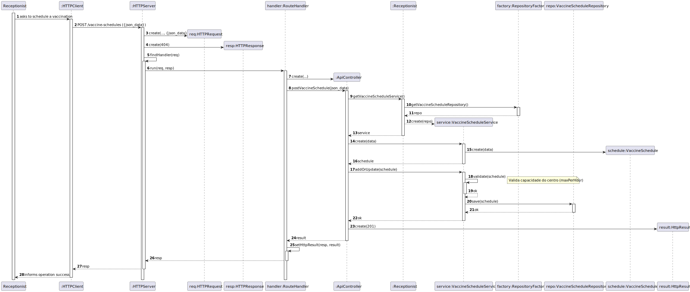
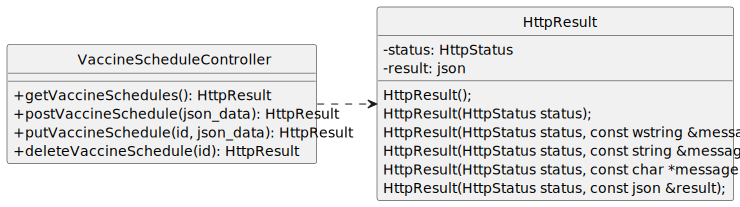

# US 21 - As Receptionist, I want to schedule a vaccine administration for an SNS user.

## 1. Requirements Engineering

### 1.1. User Story Description

As Receptionist, I want to schedule a vaccine administration for an SNS user.

### 1.2. Customer Specifications and Clarifications

**From the specifications document:**

> A Vaccine Schedule is defined by a specific date and time, the unique identification of the SNS user, the designated vaccination center, and the vaccine type to be administered. To ensure operational integrity, the system must validate that the center has sufficient capacity to accommodate the schedule based on its maximum vaccines per hour limit.

> **Question:** 
>Ao criar uma marcação para um Sns User que atributos  deverão ser preenchidos?
Uma marcação devera ser referente apenas a  um Health Care Center ou Community Mass Vacination Center?
A possibilidade de marcação aplica-se a ambos os tipos de centers (Health Care Center ou Community Mass Vacination Center) ou apenas a um ?

> **Answer:** 
No registo de marcação da administração da vacina, deve ficar guardada a seguinte informação:
    Data e hora do agendamento
    Centro de vacinação onde será realizada a administração da vacina
    Tipo de vacina a administrar (quando aplicável)
    Identificação do SNS User para quem está a ser feito o agendamento
    A marcação é sempre associada a um único centro de vacinação.
    A marcação pode ser realizada para qualquer centro disponível, seja um healthcare center ou um community mass vaccination center.

> **Question:** 
>Pode existir mais que uma marcação, numa determinada data e hora?

> **Answer:** 
Sim, mas as marcações estão limitadas ao número máximo de vacinas que o centro de vacinação consegue administrar por hora.

### 1.3. Acceptance Criteria

- **AC21-1:** The SNS user must exist in the system, identified by a unique SNS number.
- **AC21-2:** The appointment requires available slots at the selected center, respecting its hourly capacity.
- **AC21-3:** All data (SNS number, center, date, time, and vaccine type) must be validated prior to confirmation.
- **AC21-4:** A summary must be displayed for final confirmation by the receptionist.

### 1.4. Found out Dependencies

- **US20 (Register SNS User):** Needed to provide and validate the SNS Number.
- **US13 (Register Vaccination Center):** Needed to select a valid location and check its capacity (maxVaccinesPerHour).
- **US10 (Specify Vaccine Type):** Needed to categorize the appointment.

### 1.5 Input and Output Data

**Input Data:**

- Typed data:
    - SNS user number
    - Appointment date
    - Appointment time

- Selected data:
    - Vaccination center
    - Vaccine type
  
**Output Data:**

- SNS user identification/details
- List of available vaccination centers
- Appointment summary for confirmation
- (In)success of the operation

### 1.6. System Sequence Diagram (SSD)

### 1.7 Other Relevant Remarks

- The created task is defined and classified.

## 2. OO Analysis

### 2.1. Relevant Domain Model Excerpt

### 2.2. Other Remarks

- VaccineSchedule Identity: A VaccineSchedule is uniquely identified by the combination of the SNSUser, the Date, and the Time, ensuring that an SNS user cannot have two appointments at the exact same time.
- Vaccination Center Capacity: The association between VaccineSchedule and VaccinationCenter must respect the center's maxVaccinesPerHour configuration, which acts as a business constraint during the scheduling process.
- SNSUser Validation: An appointment can only be created for an SNSUser that is already registered in the system (dependency on US20).

## 3. Design - User Story Realization

### 3.1. Rationale

| Interaction ID | Question: Which class is responsible for... | Answer | Justification |
|:--- |:--- |:--- |:--- |
| **Step 1** | ...instantiating the UI and starting the process? | **ScheduleVaccineView** | **Pure Fabrication**: Provides the interface without coupling domain logic to UI. |
| **Step 2** | ...coordinating the start and preparing services? | **ScheduleVaccineController** | **Controller**: Coordinates the use case and delegates service discovery to the active Role. |
| **Step 3** | ...collecting data without exposing the domain? | **VaccineScheduleDto** | **DTO Pattern**: Transports user input securely across layers, protecting Domain integrity. |
| **Step 4** | ...providing the list of existing users/types? | **SNSUserService** | **Information Expert**: Knows how to retrieve and filter user/vaccine data for the UI. |
| **Step 5** | ...creating the schedule object? | **VaccineScheduleService** | **Creator / High Cohesion**: Instantiates the domain entity after validating dependencies. |
| **Step 6** | ...retrieving data for the summary? | **ScheduleVaccineController** | **Indirection**: Bridges the service result back to the view. |
| **Step 7** | ...validating and persisting the schedule? | **VaccineScheduleService** | **Information Expert**: Accesses repositories to verify business rules and save the entity. |
| **Step 8** | ...notifying the user of the final result? | **ScheduleVaccineView** | **Pure Fabrication**: Responsible for final user notification. |

### Systematization

According to the taken rationale, the conceptual classes promoted to software classes are:

- SNSUser
- VaccinationCenter
- VaccineSchedule
- VaccineType
- Receptionist

Other software classes (i.e. Pure Fabrication) identified:

- ScheduleVaccineView
- ScheduleVaccineController
- VaccineScheduleService
- SNSUserService
- VaccineScheduleDto
- SNSUserDto

- SNSUserRepository
- VaccineTypeRepository
- VaccineScheduleRepository
- VaccinationCenterRepository
- RepositoryFactory

### 3.2. Sequence Diagram (SD)

### 3.3. Class Diagram (CD)

# REST API - US21

## 4. Sequence Diagrams (SD)

### 4.1. CREATE operation

## 5. Class Diagram (CD)

_In this section, you should present a UML static view representing the main software classes related to the REST API (considering all CRUD operations), including relationships between classes, methods, and attributes._

## 6. Tests

- n/a

## 7. Construction (Implementation)

**Endpoint Exposure (CREATE):** A POST-type route was implemented to allow the receptionist to schedule a vaccine administration for an SNS user. The request receives the SNS user number, the selected vaccine type, the vaccination center, and the desired date and time as input parameters encoded in JSON.

**Flow Management in the Controller:** The VaccineScheduleController acts as the REST entry point, responsible for extracting request data, validating input parameters, and coordinating the execution of the use case while returning an HttpResult that complies with the generic HTTP request flow.

**Business Rules and Validation:** The VaccineScheduleService encapsulates the domain logic to validate the SNS user’s eligibility, verify the existence of the selected vaccine type and vaccination center, and ensure that the requested date and time are available. The service enforces the acceptance criteria by preventing overlapping appointments and invalid scheduling requests.

**Persistence:** Upon successful validation, the system creates a new VaccineSchedule and persists it using the VaccineAppointmentRepository. The repository abstraction allows the persistence mechanism to be replaced without impacting the REST API or application logic.

**Data Transformation (Response Mapping):** To protect the domain model, the REST API returns only the relevant appointment information (appointment identifier, scheduled date and time, and status) encoded as JSON within the HttpResult.

## 8. Integration and Demo

      int op = -1;
      while (op != 0) {
      std::cout << "\n== PVMS Console (REST client) ==\n";
      std::cout << "=== Vaccine Types ===\n";
      std::cout << "1  - List vaccine types\n";
      std::cout << "2  - View vaccine type\n";
      std::cout << "3  - Create vaccine type\n";
      std::cout << "4  - Update vaccine type\n";
      std::cout << "5  - Delete vaccine type\n";
      std::cout << "=== Vaccines ===\n";
      std::cout << "6  - List vaccines\n";
      std::cout << "7  - View vaccine\n";
      std::cout << "8  - Create vaccine\n";
      std::cout << "9  - Update vaccine\n";
      std::cout << "10 - Delete vaccine\n";
      std::cout << "0  - Exit\n";
      std::cout << "Option: ";

        std::cin >> op;

        switch (op) {
            case 1:  vaccineTypeUI.list();   break;
            case 2:  vaccineTypeUI.view();   break;
            case 3:  vaccineTypeUI.create(); break;
            case 4:  vaccineTypeUI.update(); break;
            case 5:  vaccineTypeUI.remove(); break;

            case 6:  vaccineUI.list();       break;
            case 7:  vaccineUI.view();       break;
            case 8:  vaccineUI.create();     break;
            case 9:  vaccineUI.update();     break;
            case 10: vaccineUI.remove();     break;

            case 0: break;
            default: std::cout << "Invalid option\n";
        }
      }

## 9. Observations

- n/a