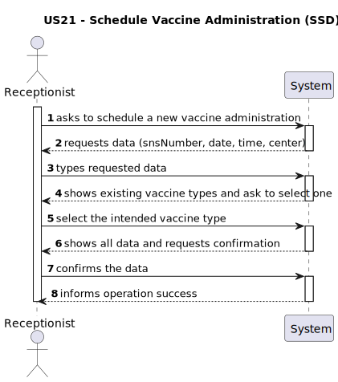
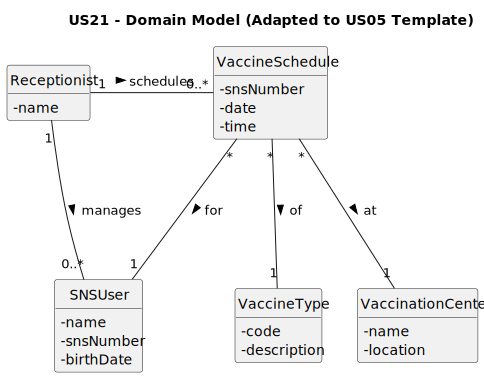
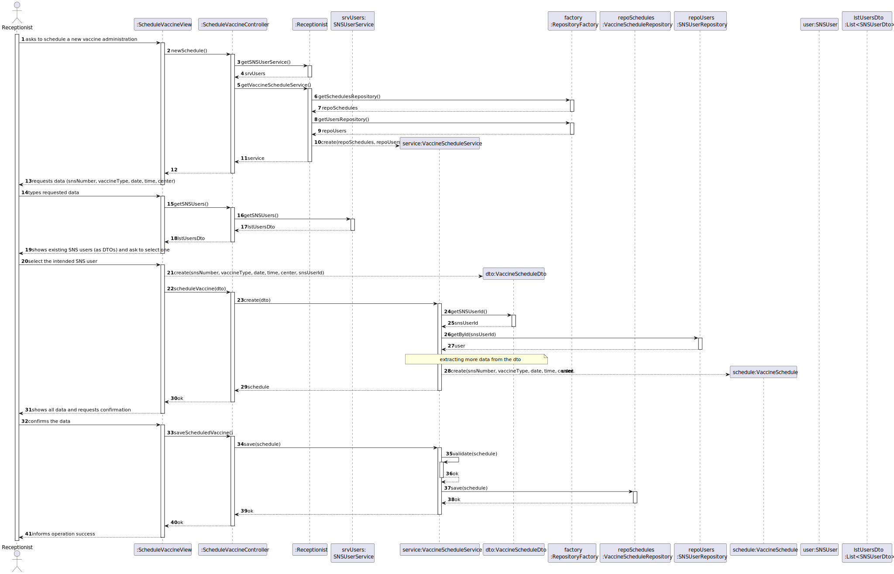
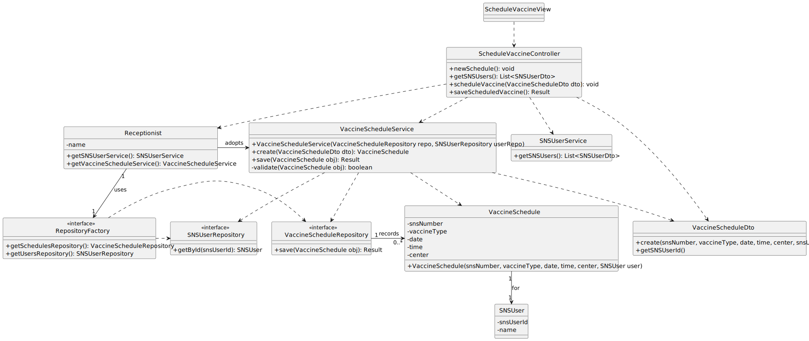

# US 21 - As Receptionist, I want to schedule a vaccine administration for an SNS user.

## 1. Requirements Engineering

### 1.1. User Story Description

As Receptionist, I want to schedule a vaccine administration for an SNS user.

### 1.2. Customer Specifications and Clarifications

**From the specifications document:**

> An appointment is characterized by having a specific date and time, the identification of the SNS user through their unique number, the vaccination center where the administration will take place, and the vaccine type to be administered. The system must ensure that the center has the capacity to accommodate the appointment based on its maximum vaccines per hour limit.

> **Question:** 
>Ao criar uma marcação para um Sns User que atributos  deverão ser preenchidos?
Uma marcação devera ser referente apenas a  um Health Care Center ou Community Mass Vacination Center?
A possibilidade de marcação aplica-se a ambos os tipos de centers (Health Care Center ou Community Mass Vacination Center) ou apenas a um ?

> **Answer:** 
No registo de marcação da administração da vacina, deve ficar guardada a seguinte informação:
    Data e hora do agendamento
    Centro de vacinação onde será realizada a administração da vacina
    Tipo de vacina a administrar (quando aplicável)
    Identificação do SNS User para quem está a ser feito o agendamento
    A marcação é sempre associada a um único centro de vacinação.
    A marcação pode ser realizada para qualquer centro disponível, seja um healthcare center ou um community mass vaccination center.

> **Question:** 
>Pode existir mais que uma marcação, numa determinada data e hora?

> **Answer:** 
Sim, mas as marcações estão limitadas ao número máximo de vacinas que o centro de vacinação consegue administrar por hora.

### 1.3. Acceptance Criteria

-- **AC21-1:** The SNS user must exist in the system, identified by a unique SNS number.
- **AC21-2:** The appointment requires available slots at the selected center, respecting its hourly capacity.
- **AC21-3:** All data (SNS number, center, date, time, and vaccine type) must be validated prior to confirmation.
- **AC21-4:** A summary must be displayed for final confirmation by the receptionist.

### 1.4. Found out Dependencies

- **US20 (Register SNS User):** Needed to provide and validate the SNS Number.
- **US13 (Register Vaccination Center):** Needed to select a valid location and check its capacity (maxVaccinesPerHour).
- **US10 (Specify Vaccine Type):** Needed to categorize the appointment.

### 1.5 Input and Output Data

**Input Data:**

- Typed data:
    - SNS user number
    - Appointment date
    - Appointment time

- Selected data:
    - Vaccination center
    - Vaccine type
  
**Output Data:**

- SNS user identification/details
- List of available vaccination centers
- Appointment summary for confirmation
- (In)success of the operation

### 1.6. System Sequence Diagram (SSD)

### 1.7 Other Relevant Remarks

- The created task is defined and classified.

## 2. OO Analysis

### 2.1. Relevant Domain Model Excerpt

### 2.2. Other Remarks

- VaccineSchedule Identity: A VaccineSchedule is uniquely identified by the combination of the SNSUser, the Date, and the Time, ensuring that an SNS user cannot have two appointments at the exact same time.
- Vaccination Center Capacity: The association between VaccineSchedule and VaccinationCenter must respect the center's maxVaccinesPerHour configuration, which acts as a business constraint during the scheduling process.
- SNSUser Validation: An appointment can only be created for an SNSUser that is already registered in the system (dependency on US20).

## 3. Design - User Story Realization

### 3.1. Rationale

| Interaction ID | Question: Which class is responsible for... | Answer | Justification |
|:--- |:--- |:--- |:--- |
| **Step 1** | ...instantiating the UI and starting the process? | **ScheduleVaccineView** | **Pure Fabrication**: Provides the interface without coupling domain logic to UI. |
| **Step 2** | ...coordinating the start and preparing services? | **ScheduleVaccineController** | **Controller**: Coordinates the use case and delegates service discovery to the active Role. |
| **Step 3** | ...collecting data without exposing the domain? | **VaccineScheduleDto** | **DTO Pattern**: Transports user input securely across layers, protecting Domain integrity. |
| **Step 4** | ...providing the list of existing users/types? | **SNSUserService** | **Information Expert**: Knows how to retrieve and filter user/vaccine data for the UI. |
| **Step 5** | ...creating the schedule object? | **VaccineScheduleService** | **Creator / High Cohesion**: Instantiates the domain entity after validating dependencies. |
| **Step 6** | ...retrieving data for the summary? | **ScheduleVaccineController** | **Indirection**: Bridges the service result back to the view. |
| **Step 7** | ...validating and persisting the schedule? | **VaccineScheduleService** | **Information Expert**: Accesses repositories to verify business rules and save the entity. |
| **Step 8** | ...notifying the user of the final result? | **ScheduleVaccineView** | **Pure Fabrication**: Responsible for final user notification. |

### Systematization

According to the taken rationale, the conceptual classes promoted to software classes are:

- SNSUser
- VaccinationCenter
- VaccineSchedule
- VaccineType
- Receptionist

Other software classes (i.e. Pure Fabrication) identified:

- ScheduleVaccineView
- ScheduleVaccineController
- VaccineScheduleService
- SNSUserService
- VaccineScheduleDto
- SNSUserDto

- SNSUserRepository
- VaccineTypeRepository
- VaccineScheduleRepository
- VaccinationCenterRepository
- RepositoryFactory

### 3.2. Sequence Diagram (SD)

### 3.2.2. REST API Perspective (reusing the domain logic)

**To accommodate the Sprint 4 requirements.**

_(to be completed by students)_

### 3.3. Class Diagram (CD)

## 4. Tests

_(to be completed by students)_

## 5. Construction (Implementation)

- n/a

## 6. Integration and Demo

_(to be completed by students)_

## 7. Observations

- n/a