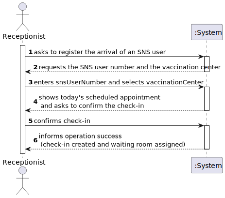
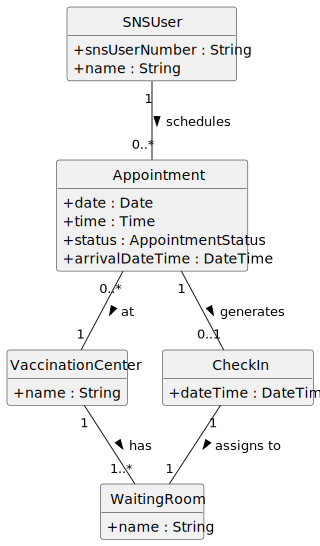
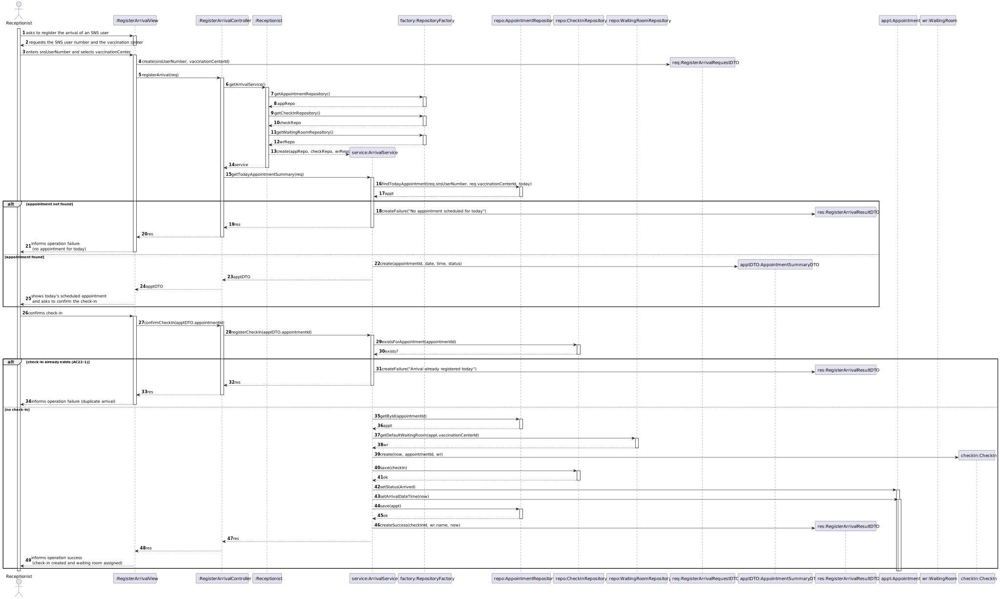
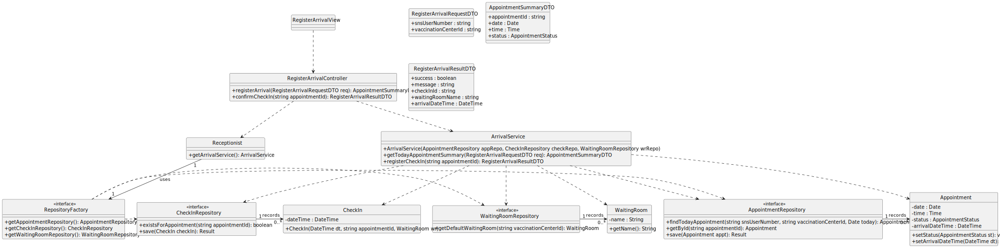
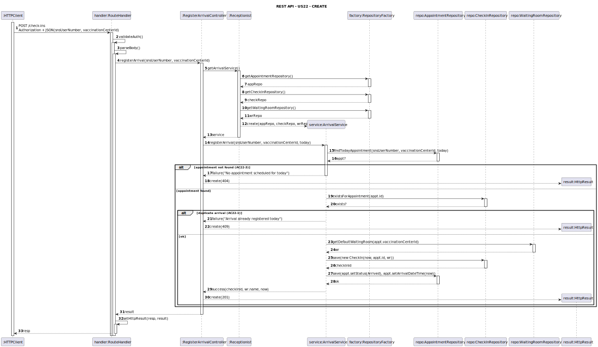
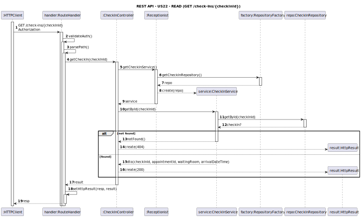
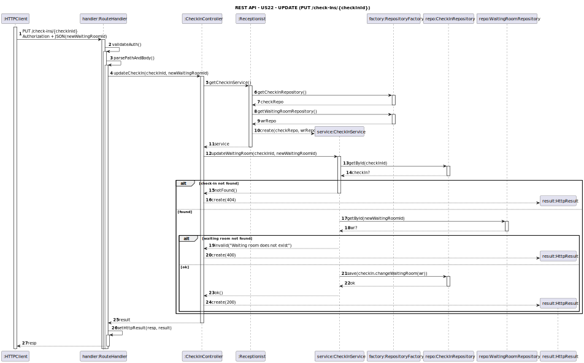
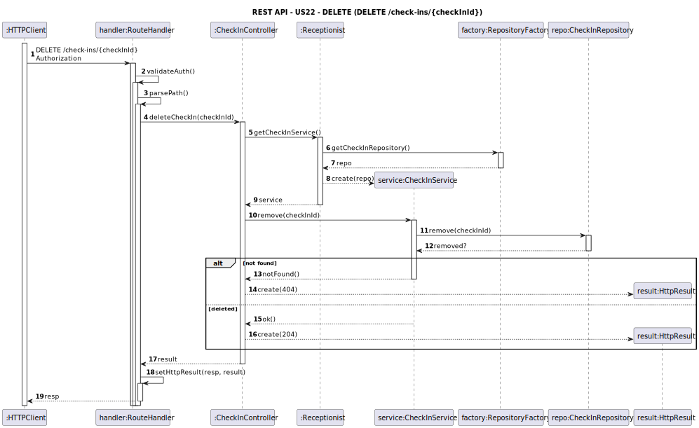
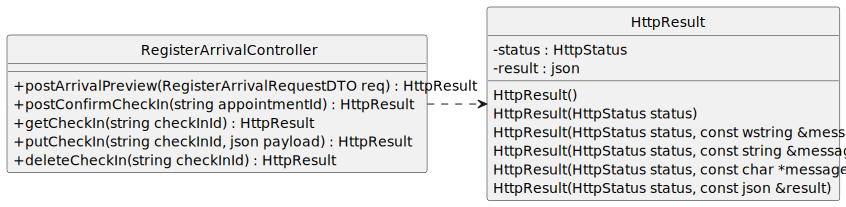

# US 22 - Register the arrival of an SNS user

## 1. Requirements Engineering

### 1.1. User Story Description

As Receptionist, I want to register the arrival of an SNS user at the vaccination center to take
the vaccine.

### 1.2. Customer Specifications and Clarifications

**From the specifications document:**

> When an SNS user arrives at the vaccination center, the receptionist registers the arrival so the user can proceed to vaccination according to the operational flow.

**From the client clarifications:**
> **Question:** Can the arrival of an SNS user only be registered if there is a prior appointment scheduled for that day?  
> **Answer:** Yes, the arrival of an SNS user can only be registered if there is a previously scheduled appointment for that day and for the same vaccination center. This ensures that no arrivals without prior scheduling are allowed.

> **Question:** What is created in the system when an arrival is registered?  
> **Answer:** When the arrival is registered, the system must create an event or state that represents the SNS user's check-in. This record is required to fulfill the acceptance criteria (AC22-1 and AC22-2).

### 1.3. Acceptance Criteria

- **AC22-1:** No duplicate entries should be possible for the same SNS user on the same day.
- **AC22-2:** The SNS user should be assigned to the waiting room.
- **AC22-3:** The arrival can only be registered if there is a scheduled appointment for the same day and vaccination center.

### 1.4. Found out Dependencies

- There is a dependency with **[US21](../US21/US21.md) – Schedule a vaccine administration**, since the arrival of an SNS user can only be registered if there is a **previous appointment scheduled for the same day and the same vaccination center**.  
  
### 1.5 Input and Output Data

**Input Data:**

- Typed data:
  - SNS user number
- Selected data:
  - Vaccination center

**Output Data:**

- (In)success of the operation
- Check-in confirmation data:
  - Check-in identifier
  - Appointment identifier
  - Assigned waiting room
  - Arrival date and time

### 1.6. System Sequence Diagram (SSD)

### 1.7 Other Relevant Remarks

* Registering an arrival creates a check-in record associated with the SNS user's appointment and assigned waiting room.

## 2. OO Analysis

### 2.1. Relevant Domain Model Excerpt

### 2.2. Other Remarks

- The concepts `CheckIn` and `WaitingRoom` were introduced in the domain model to explicitly represent the SNS user's arrival at a vaccination center, as clarified by the client.
- A `CheckIn` is associated with at most one `Appointment`, which supports the prevention of duplicate arrivals on the same day (AC22-1), and it is linked to a `WaitingRoom` to support waiting room assignment (AC22-2).

## 3. Design - User Story Realization

### 3.1. Rationale

| Interaction ID | Question: Which class is responsible for… | Answer | Justification (with patterns) |
|:--------------:|:-------------------------------------------|:-------|:------------------------------|
| Step 1 | interacting with the actor (Receptionist)? | RegisterArrivalView | **Pure Fabrication** for UI interaction; isolates the UI from domain logic. |
|  | receiving the system operation to start the use case (register arrival)? | RegisterArrivalController | **GRASP Controller**: first object to receive the system operation for this use case. |
| Step 2 | requesting the SNS user number and the vaccination center from the actor? | RegisterArrivalView | **Pure Fabrication**: responsible for collecting input data from the actor. |
| Step 3 | collecting the provided data (snsUserNumber and vaccinationCenter) to send to the controller/service? | RegisterArrivalRequest (DTO) | **Parameter Object / Pure Fabrication**: aggregates input data into a single object passed across layers. |
|  | obtaining today’s scheduled appointment for the given SNS user and vaccination center? | AppointmentRepository | **Information Expert**: stores and retrieves `Appointment` entities and supports queries such as “today’s appointment”. |
| Step 4 | presenting the scheduled appointment and requesting check-in confirmation? | RegisterArrivalView | **Pure Fabrication**: presents system information and collects confirmation from the actor. |
| Step 5 | validating that arrival can be registered (appointment exists and no duplicate check-in) (AC22-1)? | ArrivalService | **Information Expert** for business rules: encapsulates arrival constraints and prevents duplicate arrivals on the same day. |
|  | obtaining the waiting room for the selected vaccination center (AC22-2)? | WaitingRoomRepository | **Information Expert**: provides access to waiting room data associated with a `VaccinationCenter`. |
|  | creating and persisting the check-in record? | ArrivalService / CheckInRepository | **Creator** (ArrivalService) creates the `CheckIn` using required data; **Pure Fabrication** (CheckInRepository) persists it. |
| Step 6 | informing the actor about operation success or failure? | RegisterArrivalView | **Pure Fabrication**: provides user feedback while keeping business logic in the service layer. |

### Systematization

According to the taken rationale, the conceptual classes promoted to software classes are:

- SNSUser
- Appointment
- VaccinationCenter
- WaitingRoom
- CheckIn

Other software classes (i.e. Pure Fabrication) identified:

- RegisterArrivalView
- RegisterArrivalController
- ArrivalService
- AppointmentRepository
- WaitingRoomRepository
- CheckInRepository
- RepositoryFactory
- RegisterArrivalRequest (DTO)

### 3.2. Sequence Diagram (SD)

### 3.2.1. Previous Perspective (using Controllers for a Console UI)

### 3.3. Class Diagram (CD)

### 3.3.1. Previous Perspective (using Controllers for a Console UI)

# REST API - 22
## 4. Sequence Diagrams (SD)

### 4.1. CREATE operation

### 4.2 READ operation

### 4.3. UPDATE operation

### 4.4. DELETE operation

## 5. Class Diagram (CD)

## 6. Tests
n/a

## 7. Construction (Implementation)

- n/a

## 8. Integration and Demo

      int op = -1;
      while (op != 0) {
      std::cout << "\n== PVMS Console (REST client) ==\n";
      std::cout << "=== Vaccine Types ===\n";
      std::cout << "1  - List vaccine types\n";
      std::cout << "2  - View vaccine type\n";
      std::cout << "3  - Create vaccine type\n";
      std::cout << "4  - Update vaccine type\n";
      std::cout << "5  - Delete vaccine type\n";
      std::cout << "=== Vaccines ===\n";
      std::cout << "6  - List vaccines\n";
      std::cout << "7  - View vaccine\n";
      std::cout << "8  - Create vaccine\n";
      std::cout << "9  - Update vaccine\n";
      std::cout << "10 - Delete vaccine\n";
      std::cout << "0  - Exit\n";
      std::cout << "Option: ";

        std::cin >> op;

        switch (op) {
            case 1:  vaccineTypeUI.list();   break;
            case 2:  vaccineTypeUI.view();   break;
            case 3:  vaccineTypeUI.create(); break;
            case 4:  vaccineTypeUI.update(); break;
            case 5:  vaccineTypeUI.remove(); break;

            case 6:  vaccineUI.list();       break;
            case 7:  vaccineUI.view();       break;
            case 8:  vaccineUI.create();     break;
            case 9:  vaccineUI.update();     break;
            case 10: vaccineUI.remove();     break;

            case 0: break;
            default: std::cout << "Invalid option\n";
        }
    }

## 9. Observations

- n/a