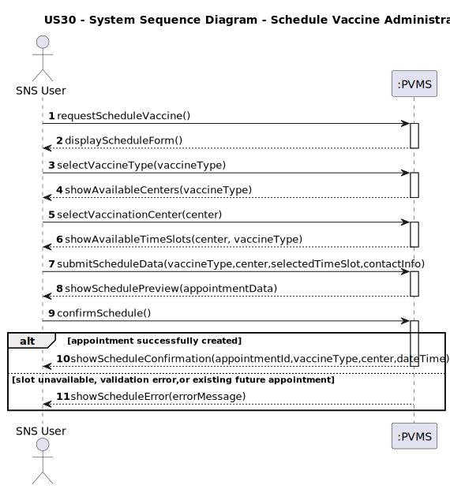
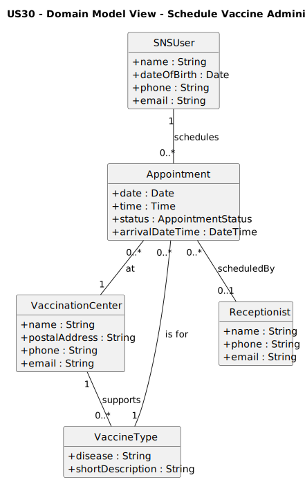
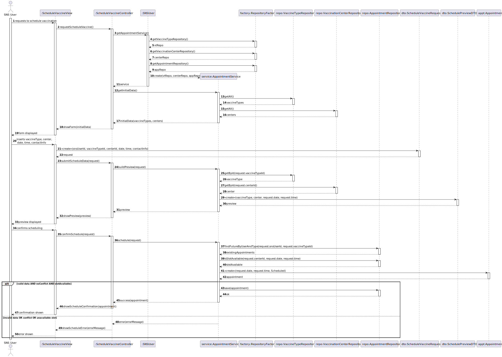
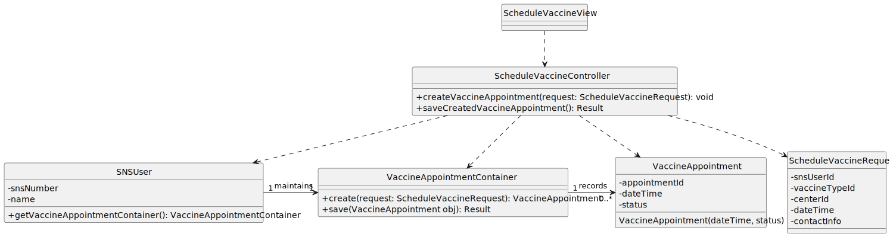

# US30 - register a vaccine

## 1. Requirements Engineering

### 1.1. User Story Description

As SNS user, I intend to use the application to schedule a vaccine administration.

###### 1.2. Customer Specifications and Clarifications

**From the specifications document:**

The system must allow an authenticated **SNS user** to schedule a vaccine administration for themselves.

To schedule a vaccine administration, the SNS user must:

- Select a **vaccine type** from the existing vaccine types registered in the system.
- Select a **vaccination center** that supports the chosen vaccine type.
- Choose an available **date and time** for the administration.
- Review and **confirm** the appointment details before final submission.

The system must ensure that the selected date and time are still available at the moment of confirmation.

**From the client clarifications:**

> **Question:** Who initiates the scheduling of a vaccine administration?  
> **Answer:** The scheduling is conceptually initiated by the **SNS user**, who schedules the vaccine administration for themselves.

> **Question:** How is scheduling handled in a presencial support scenario?  
> **Answer:** In presencial scheduling, the SNS user may be assisted by a **receptionist**.  
> In this case, the operation is performed using the **receptionist’s staff account**, but the scheduling remains conceptually associated with the SNS user.

> **Question:** Is authentication required to schedule a vaccine administration?  
> **Answer:** Yes. The scheduling requires an **authenticated profile**, either an SNS user or a receptionist acting on behalf of an SNS user.

### 1.3. Acceptance Criteria

- **AC30-1:** The scheduling functionality must only be accessible to **authenticated profiles** (SNS user or receptionist acting on behalf of an SNS user).

- **AC30-2:** The SNS user must select a **vaccine type**, a **vaccination center that supports that vaccine type**, and an **available date and time**.

- **AC30-3:** The system must verify, at the moment of confirmation, that the selected date and time are still available.

- **AC30-4:** Upon successful scheduling, the system must display a confirmation message containing the appointment identifier, vaccine type, vaccination center, and scheduled date and time.

- **AC30-5:** If the appointment cannot be created, the system must present an error message and must not create the appointment.

### 1.4. Found Out Dependencies

- The list of **VaccineTypes** must already exist in the system.
- The list of **VaccinationCenters** and the association between vaccination centers and the vaccine types they support must be previously configured.
- The **availability information** (dates and times) for each vaccination center and vaccine type must be defined before scheduling can occur.

### 1.5 Input and Output Data

**Input Data:**

- **Selected data:**
  - Vaccine type
  - Vaccination center
  - Date and time for the vaccine administration

**Output Data:**

- Confirmation message with the scheduled appointment details (in case of success)
- Error message indicating why the appointment could not be scheduled (in case of failure)

### 1.6. System Sequence Diagram (SSD)

### 1.7 Other Relevant Remarks

- In presencial support scenarios, the scheduling operation may be performed using a **receptionist’s staff profile**, while remaining conceptually associated with the SNS user for whom the appointment is created.

- During the scheduling process, the SNS user selects a **vaccine type**; the concrete vaccine brand to be administered is determined later by the vaccination center.

- The availability of dates and times may change due to concurrent scheduling operations, which justifies the need for availability verification at the moment of confirmation.

## 2. Analysis

### 2.1. Relevant Domain Model Excerpt

The following excerpt of the Domain Model represents the concepts required to support the scheduling of a vaccine administration:

**Explanation:**

- **SNSUser**  
  Represents the citizen who schedules a vaccine administration for themselves.  
  A `SNSUser` may have multiple scheduled `Appointment` instances (`schedules`).

- **Appointment**  
  Represents a scheduled vaccine administration.  
  It records the scheduled `date` and `time`, its current `status`, and optionally an `arrivalDateTime`.

- **AppointmentStatus**  
  Enumerates the possible states of an `Appointment` (e.g., `Scheduled`, `Arrived`, `Vaccinated`, `Cancelled`).  
  It is used as the type of the `Appointment.status` attribute.

- **VaccineType**  
  Represents a vaccine category (e.g., COVID-19, Influenza), defined by `disease` and `shortDescription`.  
  Each `Appointment` is associated with exactly one `VaccineType` (`is for`).

- **VaccinationCenter**  
  Represents the vaccination facility where the administration will occur.  
  Each `Appointment` takes place at exactly one `VaccinationCenter` (`at`).  
  A `VaccinationCenter` may support several `VaccineType` entries (`supports`).

- **Receptionist**  
  Represents a staff member who may perform the scheduling operation using a staff account in presencial support scenarios.  
  An `Appointment` may optionally reference a `Receptionist` through `scheduledBy`.

### 2.2. Other Remarks

- The Domain Model does not explicitly represent time-slot availability. This is treated as application logic and validated during scheduling, not as a domain entity.
- The association with `Receptionist` is optional and only applies in presencial support scenarios; it does not alter the fundamental ownership of the appointment, which always belongs to the SNS user.
- No additional analysis artifacts (e.g., activity diagrams or state machines) were deemed necessary for this User Story.

## 3.1. Rationale

**The rationale grounds on the SSD interactions and the identified input/output data.**

| Interaction ID | Question: Which class is responsible for…                                                   | Answer                               | Justification (with patterns)                                                                                              |
|:--------------:|:---------------------------------------------------------------------------------------------|:-------------------------------------|:---------------------------------------------------------------------------------------------------------------------------|
| Step 1         | interacting with the actor (SNS User)?                                                       | ScheduleVaccineView                  | **Pure Fabrication** for UI interaction; isolates UI from domain logic.                                                    |
|                | receiving the system operation `requestScheduleVaccine()`?                                   | ScheduleVaccineController            | **GRASP Controller**: first object to receive input for this use case.                                                     |
|                | coordinating the execution of the US?                                                        | ScheduleVaccineController            | **Controller**: centralizes workflow orchestration.                                                                        |
| Step 2         | obtaining the list of available VaccineTypes?                                                | VaccineTypeRepository                | **Information Expert**: stores and retrieves VaccineType entities.                                                         |
| Step 3         | obtaining the list of VaccinationCenters for a given VaccineType?                            | VaccinationCenterRepository          | **Information Expert**: holds data about centers and available vaccine types.                                              |
| Step 4         | collecting user-selected data for scheduling?                                                | ScheduleVaccineRequest (DTO)         | **Pure Fabrication**: aggregates scheduling data into a single parameter object (**Parameter Object pattern**).            |
|                | validating input data (type, center, date/time)?                                             | ScheduleService                      | **Information Expert**: owns scheduling rules and validation logic.                                                        |
|                | obtaining available time slots for a given center and vaccine type?                          | ScheduleService                      | **Information Expert**: encapsulates availability logic.                                                                   |
| Step 5         | preparing appointment preview data?                                                          | ScheduleService                      | **Information Expert**: has all required data to assemble preview information.                                             |
| Step 6         | validating global constraint: user cannot have a future appointment of same type (AC30-6)?   | ScheduleService                      | **Information Expert**: manages and queries appointment rules.                                                             |
|                | verifying slot availability at confirmation time?                                            | ScheduleService                      | **Information Expert** for business rules.                                                                                 |
|                | creating a new `VaccineAppointment` instance?                                                | ScheduleService                      | **Creator**: receives the necessary data to instantiate the appointment.                                                   |
|                | persisting the appointment?                                                                  | VaccineAppointmentRepository         | **Pure Fabrication**: encapsulates storage and retrieval of appointments.                                                  |
| Step 7         | determining whether the scheduling succeeded or failed?                                      | ScheduleService                      | **Information Expert**: executes final validation and applies business constraints.                                        |
| Step 8         | informing the user of scheduling success or error?                                           | ScheduleVaccineView                  | **Pure Fabrication**: responsible for providing user feedback.                                                             |

### Systematization

According to the taken rationale, the following **conceptual classes** were promoted to software classes:

- SNSUser
- Appointment
- VaccineType
- VaccinationCenter
- Receptionist

The following **software classes** (Pure Fabrication / GRASP-motivated) were identified:

- ScheduleVaccineView
- ScheduleVaccineController
- AppointmentService
- VaccineTypeRepository
- VaccinationCenterRepository
- AppointmentRepository

The following **DTOs / parameter objects** were introduced to support data exchange between layers:

- ScheduleVaccineRequest
- SchedulePreviewDTO
)

### 3.2. Sequence Diagram (SD)

The following sequence diagram represents the dynamic view of the main software objects involved in the realization of this User Story.

### 3.3. Class Diagram (CD)

The following class diagram represents the main software classes involved in the realization of this User Story, as well as their relations, attributes and main methods.

## 4. Tests
n/a

## 5. Construction (Implementation)
n/a

## 6. Integration and Demo
n/a

## 7. Observations
n/a