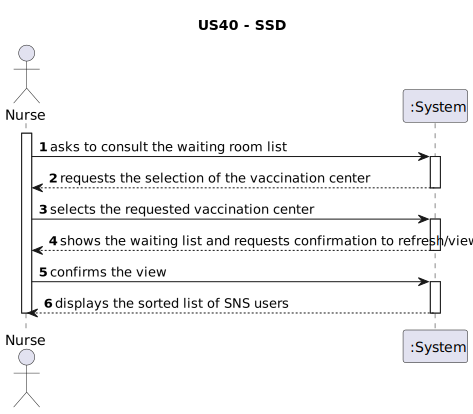
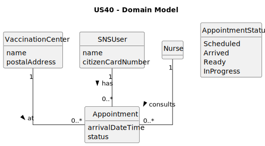
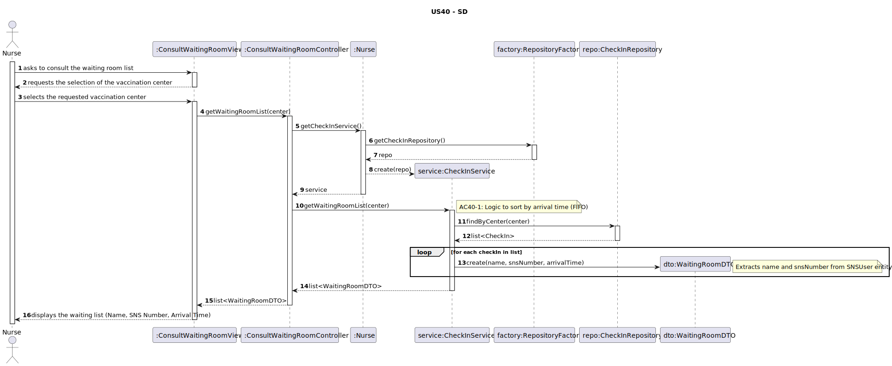
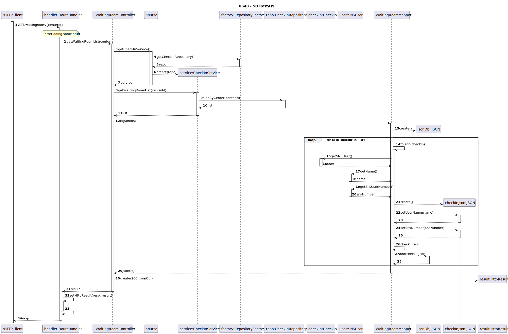
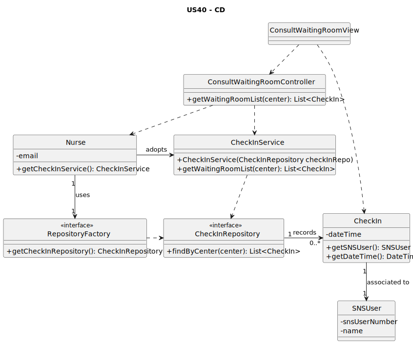
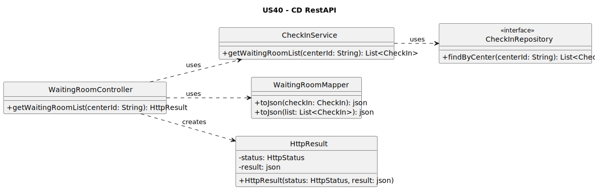

# US40 - As Nurse, I intend to consult the users in the waiting room of a vaccination center.

## 1. Requirements Engineering

### 1.1. User Story Description
As Nurse, I intend to consult the users in the waiting room of a vaccination center. 

### 1.2. Customer Specifications and Clarifications

**From the specifications document:**

>  When the SNS user arrives at the vaccination center, a receptionist registers their arrival.

**From the client clarifications:**

### 1.3. Acceptance Criteria

- **AC40-1:** The list of SNS users should be presented on a first-come, first-served basis.

### 1.4. Found out Dependencies

- The waiting room consultation depends on the Receptionist having previously registered the user's arrival in the system.
- The user must be authenticated with the "Nurse" profile.

### 1.5 Input and Output Data

**Input Data:**

* **Selected data:**
    * Vaccination Center (identification of the center where the nurse is working).

**Output Data:**
* List of SNS Users in the waiting room (Name and Arrival Time).
* (In)success message if the list is empty.

### 1.6. System Sequence Diagram (SSD)



### 1.7 Other Relevant Remarks
This functionality is crucial for the workflow of the vaccination process, as it serves as the bridge between the reception/check-in and the actual vaccine administration. 

## 2. Analysis

### 2.1. Relevant Domain Model Excerpt



### 2.2. Other Remarks

- The waiting room is a dynamic view of appointments that have changed status to "Arrived".

## 3. Design - User Story Realization

### 3.1. Rationale

| Interaction ID | Question: Which class is responsible for... | Answer | Justification (with patterns) |
| :--- | :--- | :--- | :--- |
| **Step 1 & 2** | ... interacting with the actor? | `ConsultWaitingRoomView` | **Pure Fabrication**: Responsible for managing the user interface and capturing the consultation event. |
| | ... coordinating the User Story? | `ConsultWaitingRoomController` | **Controller**: Acts as the coordinator, delegating business logic to specialist classes. |
| **Step 3** | ... selecting the vaccination center? | `ConsultWaitingRoomView` | **Pure Fabrication**: The View allows the nurse to choose the context (center) to filter the list. |
| **Step 4** | ... providing the waiting list? | `CheckInService` | **Service**: Contains the business logic to process and filter the data of users in the waiting room. |
| **Step 5** | ... retrieving data from persistence? | `CheckInRepository` | **Repository**: Centralizes access to the persisted Check-In data in the system. |
| **Step 6** | ... ensuring order (FIFO)? | `CheckInService` | **Business Logic/Information Expert**: Applies the **AC40-1** criterion (First-come, first-served) using the `arrivalDateTime` attribute. |
| **Step 6** | ... providing user details to the UI? | `CheckIn` / `SNSUser` | **Information Expert**: Domain entities hold the information (Name, SNS Number) requested by the View, following the provided template by avoiding DTOs. | 
### Systematization

Software classes identified:

* **ConsultWaitingRoomView**
* **ConsultWaitingRoomController**
* **CheckInService**
* **CheckInRepository**
* **RepositoryFactory**
* **CheckIn**
* **SNSUser**
* **VaccinationCenter**

### 3.2. Sequence Diagram (SD)

### 3.2.1. Previous Perspective (using Controllers for a Console UI)



### 3.2.2. REST API Perspective (reusing the domain logic)



### 3.3. Class Diagram (CD)

### 3.3.1. Previous Perspective (using Controllers for a Console UI)




### 3.3.2. REST API Perspective (reusing the domain logic)




## 4. Tests

Two relevant test scenarios for a concrete CheckInRepository implementation are highlighted next, ensuring the retrieval of users in the waiting room for a specific center.

**Test 1:** Getting all users in the waiting room when none exist for a given center.

**Test 2:** Getting all users in the waiting room when several exist.

```cpp
TEST_F(CheckInMemoryRepositoryFixture, GetWaitingRoomWhenEmpty){
    // Assumes the repository is empty for the specified vaccination center
    EXPECT_TRUE(this->repo->isEmpty());
    list<shared_ptr<CheckIn>> waitingList = this->repo->findByCenter(center);
    EXPECT_TRUE(waitingList.empty());
}

TEST_F(CheckInMemoryRepositoryFixture, GetWaitingRoomWhenPopulated){
    // The fixture populates the repository with 4 Check-In records for the specific center
    this->populateWithFourCheckIns(center);
    list<shared_ptr<CheckIn>> waitingList = this->repo->findByCenter(center);
    
    // Verifies if the list size matches the number of Check-Ins created
    EXPECT_EQ(waitingList.size(), 4);
}
```

## 5. Construction (Implementation)

n/a

## 6. Integration and Demo

A menu option on the nurse console application was added. This option invokes the ConsultWaitingRoomView, passing the required user token for authentication and context.

```cpp
int NurseMenuView::processMenuOption(int option) {
    int result = 0;
    BaseView * view;
    switch (option) {
        case 1:
            // Option to consult the waiting room list
            view = new ConsultWaitingRoomView(this->userToken);
            view->show();
            delete view;
            break;
        case 2:
            // Other nurse functionalities...
            break;
        default:
            result = -1;
    }
    return result;
}
```

## 7. Observations

n/a