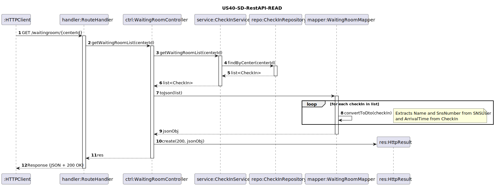

# US40 - As Nurse, I intend to consult the users in the waiting room of a vaccination center.

## 1. Requirements Engineering

### 1.1. User Story Description
As Nurse, I intend to consult the users in the waiting room of a vaccination center. 

### 1.2. Customer Specifications and Clarifications

**From the specifications document:**

>  When the SNS user arrives at the vaccination center, a receptionist registers their arrival.

**From the client clarifications:**

### 1.3. Acceptance Criteria

- **AC40-1:** The list of SNS users should be presented on a first-come, first-served basis.

### 1.4. Found out Dependencies

- The waiting room consultation depends on the Receptionist having previously registered the user's arrival in the system.
- The user must be authenticated with the "Nurse" profile.

### 1.5 Input and Output Data

**Input Data:**

* **Selected data:**
    * Vaccination Center (identification of the center where the nurse is working).

**Output Data:**
* List of SNS Users in the waiting room (Name and Arrival Time).
* (In)success message if the list is empty.

### 1.6. System Sequence Diagram (SSD)


### 1.7 Other Relevant Remarks
This functionality is crucial for the workflow of the vaccination process, as it serves as the bridge between the reception/check-in and the actual vaccine administration. 

## 2. Analysis

### 2.1. Relevant Domain Model Excerpt


### 2.2. Other Remarks

- The waiting room is a dynamic view of appointments that have changed status to "Arrived".

## 3. Design - User Story Realization

### 3.1. Rationale

| Interaction ID | Question: Which class is responsible for... | Answer | Justification (with patterns) |
| :--- | :--- | :--- | :--- |
| **Step 1 & 2** | ... interacting with the actor? | `ConsultWaitingRoomView` | **Pure Fabrication**: Responsible for managing the user interface and capturing the consultation event. |
| | ... coordinating the User Story? | `ConsultWaitingRoomController` | **Controller**: Acts as the coordinator, delegating business logic to specialist classes. |
| **Step 3** | ... selecting the vaccination center? | `ConsultWaitingRoomView` | **Pure Fabrication**: The View allows the nurse to choose the context (center) to filter the list. |
| **Step 4** | ... providing the waiting list? | `CheckInService` | **Service**: Contains the business logic to process and filter the data of users in the waiting room. |
| **Step 5** | ... retrieving data from persistence? | `CheckInRepository` | **Repository**: Centralizes access to the persisted Check-In data in the system. |
| **Step 6** | ... ensuring order (FIFO)? | `CheckInService` | **Business Logic/Information Expert**: Applies the **AC40-1** criterion (First-come, first-served) using the `arrivalDateTime` attribute. |
| **Step 6** | ... providing user details to the UI? | `CheckIn` / `SNSUser` | **Information Expert**: Domain entities hold the information (Name, SNS Number) requested by the View, following the provided template by avoiding DTOs. | 
### Systematization

Software classes identified:

* **ConsultWaitingRoomView**
* **ConsultWaitingRoomController**
* **CheckInService**
* **CheckInRepository**
* **RepositoryFactory**
* **CheckIn**
* **SNSUser**
* **VaccinationCenter**

### 3.2. Sequence Diagram (SD)

### 3.2.1. Previous Perspective (using Controllers for a Console UI)


### 3.2.2. REST API Perspective (READ)



### 3.3. Class Diagram (CD)

### 3.3.1. Previous Perspective (using Controllers for a Console UI)


### 3.3.2. REST API Perspective 


## 4. Tests

n/a

## 5. Construction (Implementation)

**Endpoint Exposure (READ):** A GET-type route was implemented to allow the nurse to filter the waiting list through the vaccination center identifier (centerId) passed directly in the URL.

**Flow Management in the Controller:** The WaitingRoomController acts as the entry point, responsible for extracting HTTP request parameters and coordinating the final response.

**Business Logic and Sorting (FIFO):** The CheckInService contains the logic to retrieve only users with an "Arrived" status at the specific center. This component ensures compliance with acceptance criterion AC40-1 by sorting results by arrival time.

**Data Transformation (Mapping):** To fulfill output requirements and protect the domain model, a Mapper is used to convert internal entities (CheckIn and SNSUser) into a simplified transport format (JSON). This mapping ensures that only the Name, SNS User Number, and Arrival Time are sent to the client.

**Persistence:** The system interacts with the CheckInRepository to access persisted data, using an abstraction that facilitates database replacement without affecting the API logic.

## 6. Integration and Demo

```cpp
int op = -1;
    while (op != 0) {
        std::cout << "\n== PVMS Console (REST client) ==\n";
        std::cout << "=== Vaccine Types ===\n";
        std::cout << "1  - List vaccine types\n";
        std::cout << "2  - View vaccine type\n";
        std::cout << "3  - Create vaccine type\n";
        std::cout << "4  - Update vaccine type\n";
        std::cout << "5  - Delete vaccine type\n";
        std::cout << "=== Vaccines ===\n";
        std::cout << "6  - List vaccines\n";
        std::cout << "7  - View vaccine\n";
        std::cout << "8  - Create vaccine\n";
        std::cout << "9  - Update vaccine\n";
        std::cout << "10 - Delete vaccine\n";
        std::cout << "0  - Exit\n";
        std::cout << "Option: ";

        std::cin >> op;

        switch (op) {
            case 1:  vaccineTypeUI.list();   break;
            case 2:  vaccineTypeUI.view();   break;
            case 3:  vaccineTypeUI.create(); break;
            case 4:  vaccineTypeUI.update(); break;
            case 5:  vaccineTypeUI.remove(); break;

            case 6:  vaccineUI.list();       break;
            case 7:  vaccineUI.view();       break;
            case 8:  vaccineUI.create();     break;
            case 9:  vaccineUI.update();     break;
            case 10: vaccineUI.remove();     break;

            case 0: break;
            default: std::cout << "Invalid option\n";
        }
    }

    return 0;
}
    
``` 

## 7. Observations

n/a 