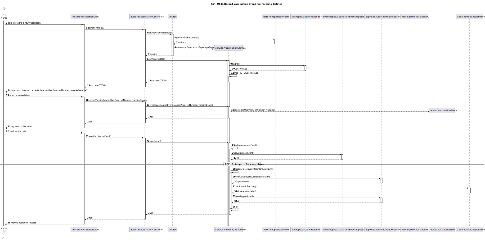
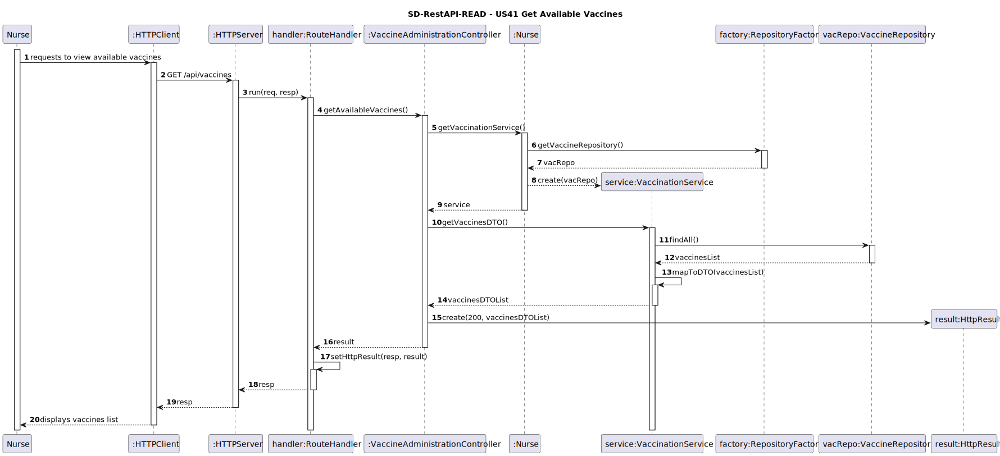
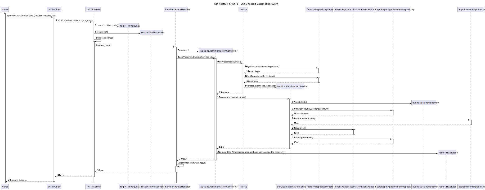
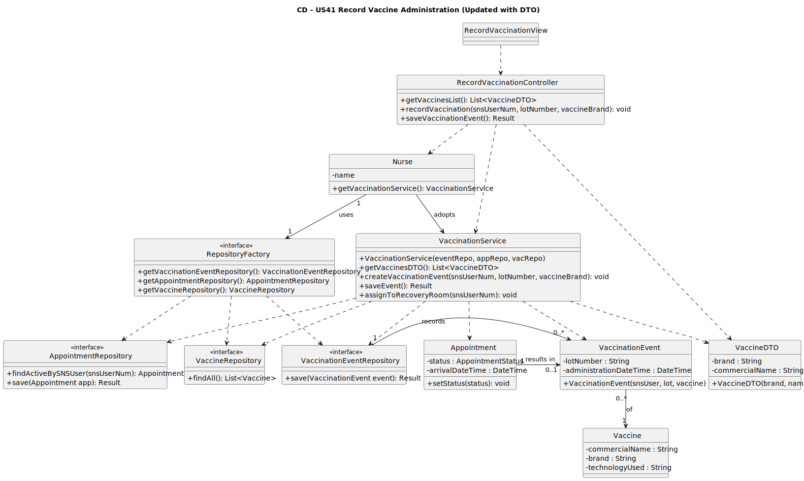
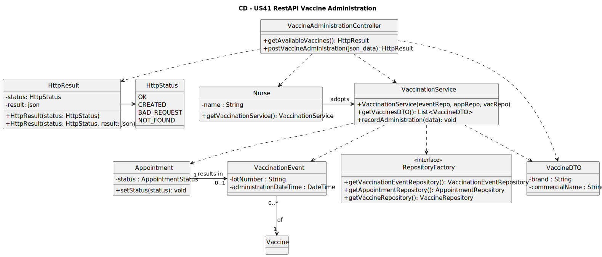

# US 41 - Record the administration of a vaccine

## 1. Requirements Engineering

### 1.1. User Story Description
As a Nurse, I want to record the administration of a vaccine to an SNS user.

### 1.2. Customer Specifications and Clarifications

**From the specifications document:**

> The nurse should select a vaccine and the administered lot number. The SNS user should be assigned to the recovery room.

**From the client clarifications:**

> **Question:** No VaccinationRecord temos o atributo da administeredDate que surge a partir do appointment previamente feito pelo SNSUser ou Rececionista. Uma vez que este atributo não é nem TypedData nem SelectedData uma vez que já vem implicitamente da US21 ou US31 (US's respetivas à marcação) , como devemos interpretar este dado na US41? Um dado que será implicitamente gerido pelo sistema e automaticamente "colocado" no VaccinationRecord tendo em conta o appointment do SNSUser?

> **Answer:** A data pode ser obtida automaticamente a partir do sistema. No entanto, a hora deve ser registada manualmente, de forma a refletir o momento exato em que a vacina foi efetivamente administrada, uma vez que pode ser diferente da hora inicialmente agendada.

> **Question:** Nesta US, no VaccinationRecord temos o atributo de adverseReaction. É referido como uma das AC's desta US que o user deve ser movido para a recovery room após a administração da vacina, onde aguarda (30min) para verificar se ocorre alguma reação adversa.
A questão é como devemos interpretar em que altura a enfermeira preenche o VaccinationRecord se no fim deste tempo de espera do SNSUser na recovery room, podendo-o fazer de uma vez só sendo que já terá toda a informação necessária. Ou se este é preenchida a dois tempos, isto é, após o user ser administrado a vacina e movido para a recovery room (com os dados da vacina o lote e a data) e só depois do tempo determinado de repouso na recovery room verificar se ocurreu alguma reação adversa (necessitando de uma atualização (update) no VaccinationRecord).

> **Answer:** Na US41, apenas é registada a administração da vacina. O registo de reações adversas será tratado numa User Story distinta.
### 1.3. Acceptance Criteria

-  **AC41-1:** The nurse should select a vaccine and the administered lot number. 
-  **AC41-2:** The SNS user should be assigned to the recovery room. 

### 1.4. Found out Dependencies

-  **UC04 - Register Arrival / Check-in:** The SNS user must have their arrival recorded to be available for vaccine administration. 
-  **UC12 - Manage Vaccine Types & Brands:** Vaccine types and brands must be previously defined in the system for the nurse to select them. 
-  **UC02 - Schedule Vaccination Appointment:** An appointment is required to link the vaccination event and update the user's status. 

### 1.5 Input and Output Data

**Input Data:**

- **Selected data:**
    -  SNS User (from the list of checked-in users). 
    -  Vaccine (the specific brand being administered). 
- **Typed data:**
    -  Lot number (the alphanumeric code of the vaccine lot). 

**Output Data:**

-  Success or failure of the operation. 
-  Confirmation that the user was assigned to the recovery room state. 
### 1.6. System Sequence Diagram (SSD)

**Note:** The system requests the SNS user, the vaccine, and the lot number. After confirmation, it informs the nurse that the user was assigned to the recovery room.

## 2. OO Analysis

### 2.1. Relevant Domain Model Excerpt

**Key entities involved:**
-  **Nurse:** The staff member responsible for administering the vaccine.
-  **SNSUser:** The person receiving the vaccine.
-  **Appointment:** Represents the scheduled event where the status is updated (e.g., to "InRecovery").
-  **VaccinationEvent:** Records the specific details like lot number and administration time.
-  **Vaccine:** The brand and technology used in the administration.

## 3. Design - User Story Realization

### 3.1. Rationale

| Interaction ID | The System... (from SSD) | Entity | Responsibility |
|:--------------|:-------------------------|:-------|:---------------|
| **Step 1** | asks to record a vaccine administration | Nurse (Actor) | Initiates the process. |
| **Step 2** | shows vaccines list and requests data | RecordVaccinationView | Interface with the Nurse. |
| | | VaccineRepository | Provide registered vaccines. |
| | | VaccineDTO | Protect domain (DTO Pattern). |
| **Step 3** | provides requested data | RecordVaccinationController | Receive and hold input data. |
| | | VaccinationService | Coordinate validation and creation. |
| **Step 4** | shows all data and requests confirmation | RecordVaccinationView | Display data for review. |
| | | VaccinationEvent | Hold administration details. |
| **Step 5** | confirms the data | VaccinationService | Coordinate saving and status update. |
| | | VaccinationEventRepository | Persist the administration record. |
| | | **Appointment** | **Information Expert**: Updates status. |
| | | AppointmentRepository | Persist updated appointment state. |
| **Step 6** | informs success and recovery transition | RecordVaccinationView | Provide success feedback. |
### Systematization

According to the taken rationale, the conceptual classes promoted to software classes are:

-  Nurse 
-  VaccinationEvent 
-  Appointment 
-  Vaccine 

Other software classes (i.e. Pure Fabrication) identified:

- RecordVaccinationView
- RecordVaccinationController
- VaccinationService
- VaccinationEventRepository
- AppointmentRepository
-  RepositoryFactory 

### 3.2. Sequence Diagram (SD)

### 3.2.1. Previous Perspective 

### 3.2.2. REST API Perspective (READ)

### 3.2.3. REST API Perspective (CREATE)

### 3.3. Class Diagram (CD)

### 3.3.1. Previous Perspective

### 3.3.2. REST API Previous Perspective

## 4. Tests

n/a

## 5. Construction (Implementation)

Implemented RecordVaccinationView (console) and RecordVaccinationController to collect SNS user, vaccine, and lot number.
Implemented VaccinationService to create VaccinationEvent, validate non-empty lot, persist via VaccinationEventRepository, and update Appointment status to InRecovery via AppointmentRepository.
Added REST endpoints: POST /api/vaccinations (creates a vaccination event, returns 201) and GET /api/vaccinations/{id} (reads vaccination event).
Kept repositories in memory with a factory to swap persistence (prepared for relational DB).

## 6. Integration and Demo

        int op = -1;
        while (op != 0) {
        std::cout << "\n== PVMS Console (REST client) ==\n";
        std::cout << "=== Vaccine Types ===\n";
        std::cout << "1  - List vaccine types\n";
        std::cout << "2  - View vaccine type\n";
        std::cout << "3  - Create vaccine type\n";
        std::cout << "4  - Update vaccine type\n";
        std::cout << "5  - Delete vaccine type\n";
        std::cout << "=== Vaccines ===\n";
        std::cout << "6  - List vaccines\n";
        std::cout << "7  - View vaccine\n";
        std::cout << "8  - Create vaccine\n";
        std::cout << "9  - Update vaccine\n";
        std::cout << "10 - Delete vaccine\n";
        std::cout << "0  - Exit\n";
        std::cout << "Option: ";

        std::cin >> op;

        switch (op) {
            case 1:  vaccineTypeUI.list();   break;
            case 2:  vaccineTypeUI.view();   break;
            case 3:  vaccineTypeUI.create(); break;
            case 4:  vaccineTypeUI.update(); break;
            case 5:  vaccineTypeUI.remove(); break;

            case 6:  vaccineUI.list();       break;
            case 7:  vaccineUI.view();       break;
            case 8:  vaccineUI.create();     break;
            case 9:  vaccineUI.update();     break;
            case 10: vaccineUI.remove();     break;

            case 0: break;
            default: std::cout << "Invalid option\n";
        }
    }

## 7. Observations

n/a