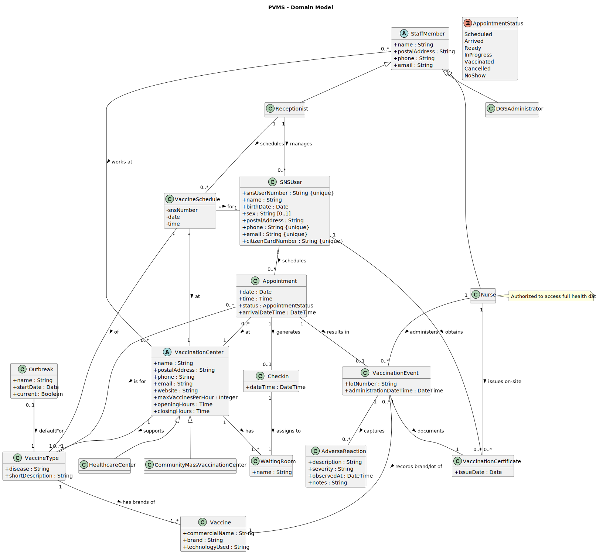

# OO Analysis

The construction process of the domain model is based on the client specifications, especially the nouns (for _concepts_) and verbs (for _relations_) used.

## Rationale to identify domain conceptual classes

To identify domain conceptual classes, we started by making a list of candidate conceptual classes inspired by the list of categories suggested in the book *"Applying UML and Patterns: An Introduction to Object-Oriented Analysis and Design and Iterative Development"* and then matched them against the global Domain Model (`DM.puml`).

### _Conceptual Class Category List_

**Business Transactions**

* `Appointment` – represents the business transaction of scheduling a vaccination for a SNS user at a specific date, time and center.
* `VaccinationEvent` – represents the actual transaction of administering a vaccine dose to a SNS user.

---

**Transaction Line Items**

* (none explicitly identified; the transactions are not decomposed into line items in this model)

---

**Product/Service related to a Transaction or Transaction Line Item**

* `VaccineType` – represents a disease-oriented category of vaccines (e.g. COVID-19, Influenza) that appointments are created for.
* `Vaccine` – represents a concrete vaccine product/brand that is actually administered in a vaccination event.
* `VaccinationCenter` – abstract representation of the service provider that performs vaccination (with concrete subtypes).

---

**Transaction Records**

* `Appointment` – records an agreed vaccination date/time, center and vaccine type for a SNS user.
* `VaccinationCertificate` – official record issued as evidence that a SNS user has been vaccinated (documents one or more vaccination events).

---

**Roles of People or Organizations**

* `SNSUser` – citizen that requests and receives vaccinations.
* `StaffMember` – abstract role representing personnel operating the system.
* `Receptionist` – staff member responsible for supporting SNS users (e.g. registration and scheduling).
* `Nurse` – staff member responsible for administering vaccines and issuing certificates.
* `DGSAdministrator` – staff member with administrative responsibilities (e.g. managing centers, vaccine types, outbreaks).

---

**Places**

* `VaccinationCenter` – abstract place where vaccination occurs.
* `HealthcareCenter` – vaccination center located in a regular healthcare facility.
* `CommunityMassVaccinationCenter` – vaccination center used for large-scale mass vaccination campaigns.
* `WaitingRoom` – represents the waiting room or queue area of a vaccination center where SNS users wait after check-in.
---

**Noteworthy Events**

* `Outbreak` – represents a disease outbreak context (name, start date, whether it is current) that may define a default vaccine type.
* `Appointment` – event where a SNS user is scheduled for vaccination.
* `VaccinationEvent` – event where a vaccine is actually administered.
* `AdverseReaction` – clinically relevant reaction observed after a vaccination event.
* `CheckIn` – represents the event/state of the SNS user's arrival at the vaccination center.
---

**Physical Objects**

* `Vaccine` – physical vaccine product/vial that is administered in a vaccination event.
* `VaccinationCenter` – physical facility/building where vaccinations are performed.

---

**Descriptions of Things**

* `VaccineType` – describes a category of vaccines for a specific disease (e.g. disease name, short description).
* `Outbreak` – describes the current outbreak scenario (name, start date, current flag) that influences defaults.
* `AppointmentStatus` (enum) – describes the possible states of an appointment (Scheduled, Arrived, Ready, etc.).

---

**Catalogs**

* `VaccineType` – acts as a catalog of supported vaccine types in the system, configurable per center.
* `AppointmentStatus` – catalog of allowed appointment states.

---

**Containers**

* `VaccinationCenter` – logical container for appointments scheduled at that location and staff members who work there.

---

**Elements of Containers**

* `Appointment` – element scheduled *at* a specific vaccination center.
* `StaffMember` (and its subtypes) – staff who *work at* one or more vaccination centers.

---

**(Other) Organizations**

* (none explicitly modeled as separate domain concepts; organizations such as DGS are represented indirectly via the `DGSAdministrator` role)

---

**Other (External/Collaborating) Systems**

* (none represented in the Domain Model)
  > Note: The **Time/Notification Service** appears as an external actor in the Use Case Diagram but is not modeled as a domain class.

---

**Records of finance, work, contracts, legal matters**

* `VaccinationCertificate` – can be seen as an official/legal record verifying that a SNS user was vaccinated.

---

**Financial Instruments**

* (none identified in the current domain model)

---

**Documents mentioned/used to perform some work**

* `VaccinationCertificate` – document produced and consulted to prove the vaccination status of a SNS user.

---

## Rationale to identify associations between conceptual classes

An association is a relationship between instances of objects that indicates a relevant connection and that is worth remembering, or it is derivable from the List of Common Associations, for example:

* **_A_** is physically or logically part of **_B_**
* **_A_** is physically or logically contained in/on **_B_**
* **_A_** is a description for **_B_**
* **_A_** is known/logged/recorded/reported/captured in **_B_**
* **_A_** uses or manages or owns **_B_**
* **_A_** is related with a transaction (item) of **_B_**
* etc.

Based on these heuristics and on the global Domain Model, the main associations are:

| Concept (A)      |     Association      | Concept (B)              |
|------------------|:--------------------:|--------------------------|
| `SNSUser`        |      schedules       | `Appointment`            |
| `Appointment`    |          at          | `VaccinationCenter`      |
| `Appointment`    |        is for        | `VaccineType`            |
| `Appointment`    |      results in      | `VaccinationEvent`       |
| `VaccinationEvent` | records brand/lot of | `Vaccine`                |
| `VaccinationEvent` |       captures       | `AdverseReaction`        |
| `SNSUser`        |       obtains        | `VaccinationCertificate` |
| `VaccinationEvent` |      documents       | `VaccinationCertificate` |
| `Nurse`          |     administers      | `VaccinationEvent`       |
| `Nurse`          |    issues on-site    | `VaccinationCertificate` |
| `StaffMember`    |       works at       | `VaccinationCenter`      |
| `VaccinationCenter` |       supports       | `VaccineType`            |
| `VaccineType`    |    has brands of     | `Vaccine`                |
| `Outbreak`       |      defaultFor      | `VaccineType`            |
| `vaccinationCenter` |         has          | `WaitingRoom`            |
| `Appointment`    |      generates       | `CheckIn`                |
| `CheckIn`         |      assigns to      | `WaintingRoom`            |

Each of these associations comes directly from requirements phrased in terms of “who schedules what”, “where an appointment takes place”, “which vaccine type a center supports”, “what a vaccination event records”, and “who issues certificates”, which are captured by the verbs used above.

---

## Domain Model

Below is a summary of the main concepts and their attributes, as defined in the global Domain Model:

- **SNSUser**  
  Attributes: `name`, `dateOfBirth`, `sex`, `postalAddress`, `phone`, `email`, `citizenCardNumber`  
  Represents a citizen registered in the national health system and using the vaccination management system.

- **StaffMember** (abstract)  
  Attributes: `name`, `postalAddress`, `phone`, `email`  
  General concept for personnel operating vaccination centers and the system.

    - **Receptionist** – specializes `StaffMember`; handles user registration and appointment scheduling.
    - **Nurse** – specializes `StaffMember`; authorized to access full health data and administer vaccines.
    - **DGSAdministrator** – specializes `StaffMember`; manages global configuration (centers, vaccine types, outbreaks).

- **VaccinationCenter** (abstract)  
  Attributes: `name`, `postalAddress`, `phone`, `email`, `website`, `maxVaccinesPerHour`, `openingHours`, `closingHours`  
  Represents a physical facility where vaccinations are carried out.

    - **HealthcareCenter** – vaccination center integrated in a standard healthcare facility.
    - **CommunityMassVaccinationCenter** – vaccination center dedicated to mass vaccination campaigns.

- **VaccineType**  
  Attributes: `disease`, `shortDescription`  
  Represents a category of vaccines targeting a specific disease. A vaccination center can support multiple vaccine types.

- **Vaccine**  
  Attributes: `commercialName`, `brand`, `technologyUsed`  
  Represents a concrete vaccine product/brand that can be used in vaccination events for a given `VaccineType`.

- **AppointmentStatus** (enum)  
  Values: `Scheduled`, `Arrived`, `Ready`, `InProgress`, `Vaccinated`, `Cancelled`, `NoShow`  
  Represents possible states in the lifecycle of an appointment.

- **Appointment**  
  Attributes: `date`, `time`, `status : AppointmentStatus`, `arrivalDateTime`  
  Represents a scheduled vaccination for a SNS user, at a given center, for a given vaccine type.

- **VaccinationEvent**  
  Attributes: `lotNumber`, `administrationDateTime`  
  Represents the actual act of administering a vaccine to a SNS user at a specific moment.

- **AdverseReaction**  
  Attributes: `description`, `severity`, `observedAt`, `notes`  
  Represents a clinically relevant reaction observed after a vaccination event.

- **VaccinationCertificate**  
  Attributes: `issueDate`  
  Represents the document issued as proof that a SNS user received a vaccination.

- **Outbreak**  
  Attributes: `name`, `startDate`, `current`  
  Represents a disease outbreak; used to configure the default `VaccineType` that should be used while the outbreak is current.

- **WaitingRoom**  
  Attributes: `name`  
  Represents the waiting room (or queue area) of a vaccination center where SNS users wait after check-in.

- **CheckIn**  
  Attributes: `dateTime`  
  Represents the event/state that records the arrival of an SNS user at the vaccination center, associated with an appointment and a waiting room.

The associations among these concepts (as detailed in the previous table) complete the Domain Model and capture how users, staff, centers, vaccine types, vaccines, appointments, events, reactions, certificates and outbreaks relate to each other in the Pandemic Vaccination Management System (PVMS).

**Domain Model Diagram**

The full Domain Model diagram is provided below (in SVG format):

